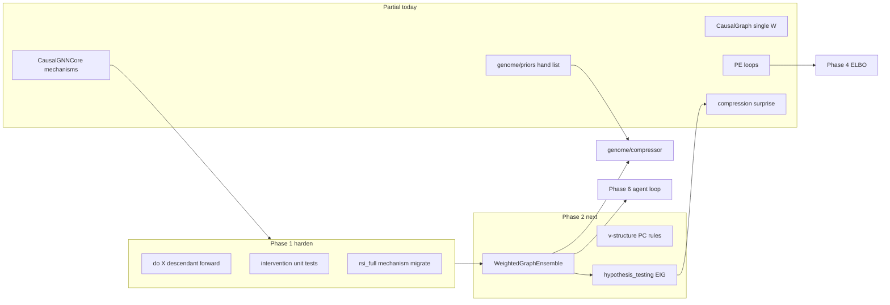
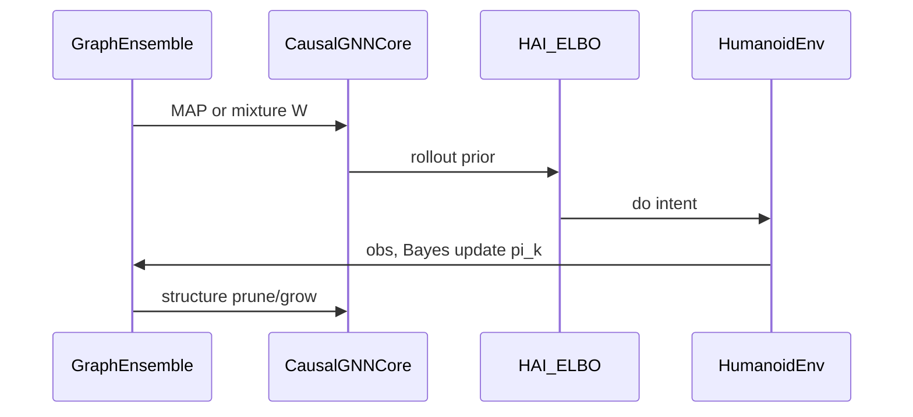

# Детальный план реализации AGI Roadmap (RKK)

Источник: [.cursor/plans/agi_implementation_plan.md](.cursor/plans/agi_implementation_plan.md)  
Порядок выполнения (из плана): **Phase 2 → Phase 3 → Phase 1 (доработка) → Phase 4 → Phase 7 → Phase 6 → Phase 5**

> **Важно про терминологию:** в UI/curriculum «Phase 1» = `fixed_root` (руки на закреплённом тазе). Это **не** AGI Phase 1 из roadmap. Ниже «Фаза 1» = только **Modular Causal World Model**.

---

## Текущее состояние (сводка)

| Фаза roadmap | Статус | Ключевые файлы |
|--------------|--------|----------------|
| **1 — Modular WM** | ~70%: `MechanismMLP` + per-node loop есть; семантика `do()`, тесты, RSI, docs — нет | [causal_gnn.py](backend/engine/causal_gnn.py), [causal_graph.py](backend/engine/causal_graph.py), [temporal_world_model.py](backend/engine/temporal_world_model.py) |
| **2 — Bayesian structure** | ~5%: одна матрица `W`, нет ensemble / v-structure / EIG | [causal_graph.py](backend/engine/causal_graph.py), [rsi_structural.py](backend/engine/rsi_structural.py) (нейрогенез, не PC) |
| **3 — Genome compression** | ~40%: ручные `CAUSAL_PRIORS` в [genome/priors.py](backend/engine/genome/priors.py); нет offline compressor | `genome/compressor.py` — отсутствует |
| **4 — HAI (ELBO)** | ~30%: PE-PID в [hierarchical_active_inference.py](backend/engine/hierarchical_active_inference.py) | [multiscale_time.py](backend/engine/multiscale_time.py) |
| **5 — Intrinsic EIG** | ~40%: compression + surprise в [intristic_objective.py](backend/engine/intristic_objective.py); нет ensemble disagreement | `hypothesis_testing.py` — отсутствует |
| **6 — Embodiment loop** | ~50%: pipeline в [agent.py](backend/engine/agent.py) + sim tick; нет Bayes-update ensemble + replay по causal surprise | [mixin_tick.py](backend/engine/features/simulation/mixin_tick.py) |
| **7 — SNN System1** | 0% (явно отложена) | [system1.py](backend/engine/system1.py) |



---

## Фаза 1 (доработка): Modular Causal World Model

### Что уже соответствует плану

- Per-node `MechanismMLP` в `CausalGNNCore.mechanisms` ([строки 243–246, 309–314](backend/engine/causal_gnn.py)).
- Агрегация родителей: `agg = einsum('ji, bjh -> bih', A, h)` вместо shared `msg_fn`/`out_dec`.
- WM в проде: `RKK_WM_RSSM=0` в [.env](.env); rollouts через `integrate_world_model_step` / `forward_dynamics_seq` в [causal_graph.py](backend/engine/causal_graph.py).
- `intervention_loss` маскирует loss на intervened index.

### Недостатки (обязательно закрыть)

1. **Документация устарела** — module header и docstring `CausalGNNCore` всё ещё описывают `msg_fn`/`out_dec` ([causal_gnn.py:11–14, 202–214](backend/engine/causal_gnn.py)).
2. **RSI resize сломан** — [rsi_full.py:83–86](backend/engine/rsi_full.py) копирует `msg_fn`/`out_dec`, которых нет → рост графа через RSI может падать или молча пропускать веса.
3. **Семантика `do(X)` неполная** — полный `forward_dynamics` для всех узлов; маска только на loss intervened node. Градиенты и предсказания non-descendants всё ещё зависят от общего `W` и shared `node_enc`/`action_enc` (план требует: только потомки X пересчитываются; механизм X без grad).
4. **Нет verification tests** из плана (единственный smoke: `backend/test_gnn.py`, не в `tests/`).
5. **RSSM не вычищен** — [temporal_world_model.py](backend/engine/temporal_world_model.py) deprecated, но код и ветки в `causal_graph`/`mixin_episodic_rssm` остаются.
6. **Производительность** — Python-цикл `for i in range(d)` на каждом forward; при d≈130+ стоит batched mechanisms или `torch.vmap`.
7. **Частичная модульность** — shared `W`, encoders, global `sz_head_z` — осознанный компромисс; зафиксировать в ADR, не выдавать за «полную» модульность Pearl.

### Задачи Фазы 1 (порядок)

#### 1.1 Спецификация и ADR (0.5 дня)

- Короткий ADR в `backend/docs/` (или комментарий в `causal_gnn.py`): что modular = per-node decoder; что shared = `W` + encoders; target hidden dims (`RKK_MECHANISM_HIDDEN`, default 24).
- Ответ на open question плана: default **2-layer MLP, hidden=24–32**; при d>100 — optional shared-bottleneck encoders + per-node только `out_*` heads.

#### 1.2 Корректный `do(X)` forward (2–3 дня)

Файл: [causal_gnn.py](backend/engine/causal_gnn.py)

- Добавить `descendants_mask(int_var_idx) -> (d,) bool` по DAG из `W_masked()` (топологический порядок).
- Новый метод `forward_dynamics_under_do(X, a, int_var_idx, int_val)`:
  - Зафиксировать embedding/value узла X (hard assign в h или clamp predicted X).
  - Пересчитать **только** узлы в `descendants(X)` (итерация по topo order).
  - Non-descendants: вернуть `X` (или frozen one-step без обновления).
- `intervention_loss`: использовать новый forward; `torch.no_grad()` + `detach` на non-descendant mechanisms; `requires_grad=False` на `mechanisms[int_var_idx]` на шаге intervention training.
- Опционально: отдельный backward только по descendant mechanism params (optimizer hook).

**Критерий приёмки:** unit test — при `do(X)`, изменение loss по non-descendant mechanism weights ≈ 0 (или pred unchanged при frozen X).

#### 1.3 Тесты (1 день)

Новый файл: `backend/tests/test_causal_gnn_intervention.py`

- `test_do_masks_intervened_mechanism_gradients`
- `test_do_non_descendants_prediction_invariant` (или bounded delta < ε)
- `test_resize_preserves_mechanism_weights` (использует `resize_to`)
- Перенести/адаптировать smoke из `backend/test_gnn.py` в pytest.

#### 1.4 RSI / neurogenesis совместимость (1 день)

- [rsi_full.py](backend/engine/rsi_full.py): заменить копирование `msg_fn`/`out_dec` на:
  - `node_enc`, `action_enc`, `target_enc`
  - `mechanisms[i]` для `i < old_d`; Xavier init для новых индексов
- [causal_gnn.py `resize_to`](backend/engine/causal_gnn.py): обновить комментарии; при росте d — init новых `MechanismMLP` из соседнего parent cluster (optional heuristic).
- Прогон: `RKK_RSI` / neurogenesis resize на humanoid d~100 без AttributeError.

#### 1.5 Документация и cleanup RSSM (1 день)

- Обновить header/docstring в `causal_gnn.py`.
- [temporal_world_model.py](backend/engine/temporal_world_model.py): пометить `@deprecated`, вынести RSSM в `backend/engine/legacy/rssm_lite.py` или удалить ветки если `RKK_WM_RSSM` не используется 30+ дней.
- [causal_graph.py](backend/engine/causal_graph.py): единая точка `get_world_model_core()` → только `CausalGNNCore`.
- [.env](.env): комментарий «RSSM legacy, do not enable».

#### 1.6 Производительность (опционально, после 1.2)

- Batched `MechanismMLP` (stack weights) или `torch.compile` на `_message_pass` при `RKK_GNN_COMPILE=1`.
- Benchmark: ms/tick WM train при d=129 до/после.

**Env (новые):**

| Key | Default | Назначение |
|-----|---------|------------|
| `RKK_MECHANISM_HIDDEN` | 24 | hidden dim per mechanism |
| `RKK_DO_DESCENDANT_ONLY` | 1 | новый do-forward |
| `RKK_MECHANISM_BATCHED` | 0 | batched mechanisms |

---

## Фаза 2: Bayesian Structure Learning (следующая по roadmap)

**Цель:** ensemble гипотез графа + ориентация + EIG для exploration.

### 2.1 `WeightedGraphEnsemble` (3–4 дня)

Новый: `backend/engine/graph_ensemble.py`

```python
class WeightedGraphEnsemble:
    W_stack: Tensor  # (N, d, d)
    log_weights: Tensor  # (N,)
    def sample_graph() / def posterior_mean() / def update_posterior(log_likelihood)
```

Интеграция в [causal_graph.py](backend/engine/causal_graph.py):

- `CausalGraph._core` остаётся одним **executive** WM для скорости; ensemble хранит `{W_k, π_k}`.
- `W_masked()` для обучения = mixture или MAP graph; переключатель `RKK_GRAPH_ENSEMBLE_N` (default 4–8).

### 2.2 v-structure + PC rules (4–5 дней)

Новый: `backend/engine/structure_learning.py`

- Collider test: `A — C — B`, A⊥B|C, A⊥̸B|C,S.
- Правила ориентации (Meek rules) поверх существующего discovery (concept plateau / stress matrix в [rsi_structural.py](backend/engine/rsi_structural.py) — не путать с CMI learner из плана).
- Hook: после plateau или каждые `RKK_STRUCTURE_LEARN_EVERY` тиков — предложить directed edges, обновить ensemble.

**Тесты:** `test_v_structure_detection.py`, synthetic SCM с collider.

### 2.3 `hypothesis_testing.py` (2–3 дня)

- EIG между предсказаниями `forward_dynamics` под `W_1..W_N` для candidate `do(var)`.
- API: `eig_for_action(graph, obs, candidate_interventions) -> float`.
- Экспорт в snapshot для UI.

**Критерий:** при синтетическом конфликте двух графов EIG максимален на различающемся ребре.

---

## Фаза 3: Genome Priors via Compression (roadmap priority 1 после 2)

### 3.1 Offline compressor (3–4 дня)

Новый: [backend/engine/genome/compressor.py](backend/engine/genome/compressor.py)

- Скрипт `backend/tools/compress_genome.py`: собрать `W` / ensemble means из логов (flat, slope, stairs presets).
- SVD / low-rank `W ≈ U V^T`, rank `k` via `RKK_GENOME_RANK`.
- Export: `genome/compressed_prior.npz` + sparse edge list.

### 3.2 Интеграция в priors (2 дня)

- [genome/priors.py](backend/engine/genome/priors.py): `load_compressed_genome()` → seed `W` ensemble + `CAUSAL_PRIORS` merge.
- **Molecular tags** на `CausalNode`: `node_kind in {sensor, motor, latent}` — запрет рёбер (sensor без parents, motor не parent motor) в structure learner.

**Ручная проверка:** визуализация выживших рёбер (bilateral symmetry в hip/knee).

---

## Фаза 4: Hierarchical Active Inference (ELBO)

### 4.1 Generative levels (5–7 дней)

[backend/engine/hierarchical_active_inference.py](backend/engine/hierarchical_active_inference.py)

- Level 0 sensorimotor: `q(s_0)`, Gaussian obs model, precision `π_o`.
- Level 1 cognitive: prior from executive; PE ascent.
- Заменить hand-tuned PID на 1–2 gradient steps ELBO / `RKK_HAI_ELBO_STEPS`.

### 4.2 Learned temporal abstraction

[multiscale_time.py](backend/engine/multiscale_time.py): boundary detection по spike `prediction_error` → динамический macro-tick вместо фикс. 5/20.

**Зависимость:** стабильный modular WM (Фаза 1.2) для GNN prior в HAI.

---

## Фаза 7: Intrinsic Motivation (перед Phase 6 в roadmap)

### 5.1 Ensemble-based curiosity

[intristic_objective.py](backend/engine/intristic_objective.py)

- Подключить EIG из `hypothesis_testing.py` как основной `curiosity` term.
- Deprecate pure empowerment heuristic (оставить fallback при `RKK_INTRINSIC_EIG=0`).
- Channel capacity MI: Monte Carlo по ensemble rollouts (`RKK_INTRINSIC_MI_SAMPLES`).

---

## Фаза 6: Embodiment Loop & Continual Learning

### 6.1 Замкнутый цикл в [agent.py](backend/engine/agent.py)



- Replay buffer: приоритет по `causal_surprise` × `structural_importance` (редкие falls / novel edges).
- Genome EMA: медленное обновление prior weights (`RKK_GENOME_EMA_TAU`).

### 6.2 Согласование с существующим training stack

Не ломать: System2 ([system2/](backend/engine/system2/)), sleep ([sleep_consolidation.py](backend/engine/sleep_consolidation.py)), curriculum `fixed_root` — они остаются **runtime safety**, не часть WM фазы.

- Progressive scope: phase ≥1 не advance при `fixed_root` ([progressive_scope.py](backend/engine/progressive_scope.py)) — документировать; опционально `RKK_SCOPE_ADVANCE_DURING_FIXED_ROOT=0` явно.

---

## Фаза 7 (отложена): System1 SNN

Только после стабильных фаз 1–6 + метрики distill/recovery:

- LIF в [system1.py](backend/engine/system1.py), event queue, STDP — отдельный feature flag `RKK_SYSTEM1_SNN=0` default.

---

## Сквозная верификация

### Автотесты (нарастающие)

| Milestone | Tests |
|-----------|-------|
| Phase 1 done | `test_causal_gnn_intervention.py`, resize/RSI |
| Phase 2 done | `test_v_structure_detection.py`, `test_ensemble_posterior_update.py` |
| Phase 3 done | `test_genome_compressor_roundtrip.py` |
| Phase 4+ | `test_hai_elbo_step.py` |

### Manual / sim gates

- Phase 1+2: intervention отбрасывает ложную гипотезу (ensemble weight → 0).
- Humanoid: 10 min run без spike falls **during sleep** (уже исправлен sleep+fixed_root; регрессия в CI).
- Wave B gate (S2 roadmap): отдельно от AGI plan — не блокировать Phase 1.

### Наблюдаемость

- Расширить [tick_run_logger.py](backend/engine/tick_run_logger.py): `wm.mechanism_hidden`, `ensemble.N`, `ensemble.entropy`, `eig_top_action`.
- Snapshot поле `graph_ensemble` для [rkk-humanoid.jsx](src/features/simulation/rkk-humanoid.jsx) (опционально, Phase 2+).

---

## Рекомендуемый порядок спринтов

| Спринт | Содержание | Exit criteria |
|--------|------------|---------------|
| **S1** | Фаза 1.1–1.4: do-forward, tests, RSI fix | pytest green; RSI resize без crash |
| **S2** | Фаза 1.5–1.6 + Фаза 2.1–2.2: RSSM cleanup, ensemble + v-structure | ensemble N=4 в sim; v-structure unit tests |
| **S3** | Фаза 2.3 + Фаза 3: EIG + genome compressor | compressed prior loads; EIG в intrinsic |
| **S4** | Фаза 4 + 7 + 6: ELBO HAI, MI curiosity, agent loop | end-to-end tick log shows ensemble update |

---

## Риски и решения (из open questions плана)

| Вопрос | Решение |
|--------|---------|
| Memory per-node MLP | hidden=24–32; batched optional; compile; freeze mechanisms for read-only nodes |
| Ensemble size N | N=4 default, N=8 max при `RKK_GRAPH_ENSEMBLE_N`; executive WM = MAP graph |
| Compressor online vs offline | **Offline** script first; online EMA только для π_k и weak edges |
| Конфликт с S2/recovery | AGI WM не трогает `system2/`; recovery остаётся scripted + distill |

---

## Вне scope этого плана

- [agi_s2_autonomy_roadmap](.cursor/plans/agi_s2_autonomy_roadmap_e45abef7.plan.md) и [s2_recovery_foundation](.cursor/plans/s2_recovery_foundation_6608f553.plan.md) — параллельные треки, не дублировать здесь.
- Frontend redesign — только snapshot fields при необходимости.
