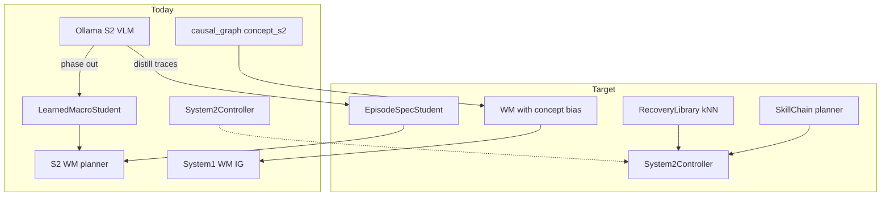
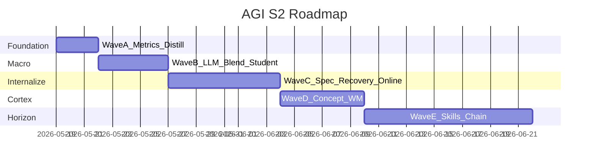

# План: AGI — от LLM-учителя к автономному System 2

## Контекст (что уже есть)

После волны 1 ([`.cursor/plans/s2_recovery_override_cef7108e.plan.md`](.cursor/plans/s2_recovery_override_cef7108e.plan.md)) и недавнего S2-gated WM:

| Компонент | Файлы | Роль |
|-----------|--------|------|
| Fast loop | [`agent.py`](backend/engine/agent.py), GNN, CPG | Локальная физика, WM train |
| S2 tick | [`controller.py`](backend/engine/system2/controller.py), [`mixin_tick.py`](backend/engine/features/simulation/mixin_tick.py) | Макрос, residuals, LLM async |
| Motor под задачу | [`wm_planner.py`](backend/engine/system2/wm_planner.py) | Imagination + PE/energy, strict gate |
| Macro student | [`learned_student.py`](backend/engine/system2/learned_student.py) | 8-D features → макрос, blend с LLM |
| Кортекс (граф) | `materialize_concept_macro` в [`causal_graph.py`](backend/engine/causal_graph.py) | `concept_s2_*` после успехов |
| Дистиллят | `system2_distill.jsonl` | Частично: `obs0`, PE, `expected_state` в `extra` |

**Пробелы (почему AGI ещё «ребёнок с учителем»):**

- [`_online_buf`](backend/engine/system2/controller.py) только накапливается (~384 эпизода), **нигде не читается**.
- Студент предсказывает **только метку макроса**, не `expected_state` / `intent_deltas` / recovery steps.
- Нейрогенез **не связан** с [`plan_s2_wm_candidate`](backend/engine/system2/wm_planner.py) (concept не в action space и не в скоре).
- Recovery steps из LLM **не пишутся** в distill → нельзя k-NN fallback без Ollama.
- Текущий distill ([`backend/logs/system2_distill.jsonl`](backend/logs/system2_distill.jsonl)) — много `success:false` по EXPLORE → снижать `LLM_BLEND` рано без метрик.

---

## Принципы (на всю дорожную карту)

1. **Один планировщик на фазу задачи** — при активной S2-задаче: strict WM ([`RKK_S2_WM_GATE_STRICT`](.env)), без EIG/CEM/goal_plan (уже в коде).
2. **Учиться только на измеримом успехе** — [`episode_success_with_pe_fallback`](backend/engine/system2/success_predicates.py); не дистиллировать «почти» без явного partial reward.
3. **LLM уходит по слоям** — макрос → episode spec → recovery sequence → VLM labels; не выключать всё сразу.
4. **Долгий горизонт = композиция коротких** — макрос (~40 тиков) + WM beam + позже skill chain.

---

## Волна A — Наблюдаемость и качество дистиллята (1–2 дня)

**Цель:** понимать, когда можно снижать `RKK_SYSTEM2_LLM_BLEND`, и не обучать студента на шуме.

**A1. Расширить distill JSONL** ([`controller.py`](backend/engine/system2/controller.py) `_append_distill` / `_record_override_distill_neuro`):

- Всегда при `source=llm` / unified VLM: `intent_deltas`, `macro` из proposal.
- При recovery: `recovery_steps` (сжатый список `{ticks, intent_deltas}`), `recovery_llm` bool.
- При конце макроса: `ending_source`, `pe_total`, `homeo_veto`.

**A2. Скрипт анализа** (новый `backend/tools/analyze_s2_distill.py` или расширить [`scratch_analyze.py`](scratch_analyze.py)):

- Success rate по `macro`, `source`, `skill_id`.
- Rolling `student_conf` vs доля `source=llm`.
- RECOVER: median `d_com_z`, `d_posture`, PE pass rate.

**A3. Пороги в `.env` (документировать, не хардкодить логику пока):**

- `RKK_S2_DISTILL_MIN_SUCCESS_RATE` — предупреждение в diag, если ниже.
- Опционально: **не вызывать neuro** на `success:false` (проверить, что streak не растёт на провалах — уже частично есть).

**A4. Tick log** ([`tick_run_logger.py`](backend/engine/tick_run_logger.py)):

- Уже есть `from_s2_wm_planner`; добавить в snapshot: `s2_wm_macro`, `student_conf`, `llm_inflight`, `recovery_steps_loaded`.

**Критерий выхода A:** отчёт «готовность к снижению blend» — например RECOVER success ≥ 25% за последние 200 эпизодов и `student_conf` median ≥ 0.42 на RECOVER obs.

---

## Волна B — Фаза 1: автономия макроса (2–4 дня)

**Цель:** LLM реже выбирает макрос; WM + студент ведут routine.

**B1. Адаптивный LLM blend** ([`controller.py`](backend/engine/system2/controller.py) `_apply_planning_step`, ~1091–1110):

- Заменить фиксированный `RKK_SYSTEM2_LLM_BLEND` на функцию от:
  - `stud_conf`, `macro`, `_outcome_ema`, success rate по макросу из `MacroStudent`.
- Env: `RKK_SYSTEM2_LLM_BLEND_MIN`, `RKK_SYSTEM2_LLM_BLEND_MAX`, `RKK_SYSTEM2_LLM_BLEND_ADAPTIVE=1`.
- **RECOVER / fallen_override:** blend выше только если `stud_conf < threshold` или нет успешных recovery в distill за последние K эпизодов.

**B2. Улучшить LearnedMacroStudent** ([`learned_student.py`](backend/engine/system2/learned_student.py)):

- Добавить 2–3 фичи: `grounded=min(foot_l,foot_r)`, `fallen_proxy=(cz<0.48 or ps<0.40)`.
- Веса классов: downweight EXPLORE failures или отдельный порог conf для EXPLORE vs RECOVER.
- По умолчанию включить bootstrap при старте, если лог > N строк: `RKK_SYSTEM2_STUDENT_BOOTSTRAP=1` после валидации лога в волне A.

**B3. Политика PLAN_EVERY** ([`.env`](.env)):

- При `stud_conf` high и macro IDLE — реже LLM (`RKK_SYSTEM2_PLAN_EVERY` динамически +48..+96 тиков).
- Ollama yield к S2 recovery сохранить ([`ollama_env.py`](backend/engine/ollama_env.py)).

**Критерий B:** ≥ 60% макро-эпизодов с `source != llm` при стабильной стойке; recovery override по-прежнему выходит по PE/wave1.

---

## Волна C — Фаза 2: internalize содержание плана (5–8 дней)

**Цель:** заменить «LLM сказал deltas/steps» внутренними модулями, опираясь на distill + online_buf.

**C1. EpisodeSpecStudent** (новый `backend/engine/system2/episode_student.py`):

- Вход: тот же `_feat_vec` + macro (one-hot).
- Выход: `expected_state` (регрессия по ключам из allowlist, sparse), `max_prediction_error` (scalar).
- Обучение: только строки distill с `success:true` и непустым `expected_state`; loss = L1 к target + штраф за ключи вне allowlist.
- В [`planning_context_for_wm`](backend/engine/system2/controller.py): если `stud_spec_conf >= threshold` — подставлять predicted spec вместо LLM proposal для PE в WM.

**C2. RecoveryLibrary** (новый `backend/engine/system2/recovery_library.py`):

- Индекс по `obs0` (6–8D) → успешные `recovery_steps` из distill.
- API: `lookup(obs) -> steps | None`; k-NN (numpy), max K=32 шаблонов.
- В [`_maybe_tick_fallen_override`](backend/engine/system2/controller.py): порядок **library → LLM** (LLM только на miss / low similarity / budget `RKK_S2_RECOVERY_LLM_CALLS_MAX`).

**C3. Оживить `_online_buf`**:

- Периодически (каждые M тиков или при success): batch update EpisodeSpecStudent или маленький MLP «obs0, action → obs1 PE».
- Env: `RKK_S2_ONLINE_LEARN_EVERY`, `RKK_S2_ONLINE_BUF_TRAIN=1`.

**C4. Distill для LLM proposals** ([`teacher.py`](backend/engine/system2/teacher.py)):

- После `validate_proposal` на успешном эпизоде — писать `intent_deltas` в distill (сейчас в основном PE extra).

**Критерий C:** ≥ 50% recovery sessions стартуют с library hit; WM PE bonus срабатывает без LLM `expected_state` в ≥ 30% recovery тиков.

---

## Волна D — Фаза 3: кортекс ↔ планирование (4–6 дней)

**Цель:** нейрогенез влияет на motor choice, не только на фоновый GNN.

**D1. Concept bias в WM** ([`wm_planner.py`](backend/engine/system2/wm_planner.py)):

- При активном `concept_s2_{macro}_*` (match `detector_id` / macro): добавить к `score_wm_trajectory` бонус за intent'ы, коррелирующие с успешными distill-траекториями для этого macro (таблица intent → weight, bootstrap из distill).
- Env: `RKK_S2_WM_CONCEPT_BIAS=1`, `RKK_S2_WM_CONCEPT_BIAS_W`.

**D2. Связка neuro ↔ curriculum** ([`physical_curriculum.py`](backend/engine/physical_curriculum.py), [`success_predicates.py`](backend/engine/system2/success_predicates.py)):

- При materialize concept — записать `skill_id` / stage id в `_concept_meta`.
- `should_attach_curriculum_pe_spec` — учитывать активный `concept_s2_*` для stage match.

**D3. Episodic bridge для S2** ([`mixin_episodic_rssm.py`](backend/engine/features/simulation/mixin_episodic_rssm.py)):

- При падении: кроме `inject_text_priors`, передать в RecoveryLibrary / planning_context краткий `physics_context` + last intents (уже есть в episodic).

**Критерий D:** после ≥1 `concept_s2_RECOVER_*` recovery time-to-stand median снижается vs контроль без concept (A/B в логах).

---

## Волна E — Фаза 4: долгосрочное планирование (8–12 дней)

**Цель:** цепочки навыков, не один макрос на 40 тиков.

**E1. Skill registry** (новый `backend/engine/system2/skills.py`):

- `skill_id` → (macro, default EpisodeSuccessSpec, entry_obs predicate, horizon_ticks).
- Curriculum stages map → skills ([`llm_curriculum.py`](backend/engine/llm_curriculum.py) `s2_expected_state`).

**E2. SkillChain в Controller**:

- `self_goal_active` / curriculum target → очередь skills (RECOVER → STAND → LOCOMOTE → …).
- Переход по `evaluate_macro_success` / PE, не только по timer `_macro_until_tick`.

**E3. WM multi-step** ([`wm_planner.py`](backend/engine/system2/wm_planner.py)):

- Env `RKK_S2_WM_DEPTH=2` по умолчанию для LOCOMOTE; energy cost на всю траекторию.
- Опционально RSSM imagination из [`mixin_episodic_rssm`](backend/engine/features/simulation/mixin_episodic_rssm.py) для 3+ шагов (если latency ок).

**E4. LLM optional mode**:

- `RKK_SYSTEM2_LLM=0` + library + EpisodeSpecStudent + SkillChain для regression bench.
- LLM только: `RKK_SYSTEM2_LLM_FALLBACK=1` при novel veto / new curriculum stage.

**Критерий E:** scripted benchmark (N падений + доставка) ≥ 70% без `source=llm` на всём эпизоде.

---

## Конфигурация (сводка по `.env`)

| Переменная | Назначение |
|------------|------------|
| `RKK_S2_WM_PLANNER=1`, `RKK_S2_WM_GATE_STRICT=1` | Уже: motor под S2 |
| `RKK_CEM_PLANNING` / `RKK_GOAL_PLANNING` | Оставить **1** в IDLE; глобальный 0 — только если хотите убрать автономию вне S2 |
| `RKK_SYSTEM2_LLM_BLEND_*` | Волна B: адаптивный blend |
| `RKK_SYSTEM2_STUDENT_BOOTSTRAP=1` | После волны A |
| `RKK_S2_RECOVERY_LIBRARY=1` | Волна C |
| `RKK_S2_EPISODE_STUDENT=1` | Волна C |
| `RKK_S2_WM_CONCEPT_BIAS=1` | Волна D |

---

## Тесты (минимум на каждую волну)

| Волна | Тесты |
|-------|--------|
| A | unit: distill row schema; snapshot keys in tick logger |
| B | `test_learned_student_blend.py`: adaptive p_use monotonic in conf |
| C | `test_recovery_library_knn.py`, `test_episode_student_spec.py` |
| D | `test_wm_concept_bias.py` recover prefers torso over stride |
| E | integration: skill chain transitions mocked obs |

Существующие: [`test_s2_wm_planner.py`](backend/tests/test_s2_wm_planner.py), [`test_system2_pe_wave2.py`](backend/tests/test_system2_pe_wave2.py).

---

## Порядок внедрения (рекомендуемый sprint)

**Не начинать B**, пока A не покажет приемлемый RECOVER/EXPLORE success rate — иначе автономия закрепит плохие макросы.

---

## Риски

- **Слишком ранний LLM off** → застревание в EXPLORE/RECOVER циклах (видно в текущем distill).
- **EpisodeSpecStudent без veto** → галлюцированные `expected_state` → ложный PE success.
- **Latency** — k-NN + WM depth=2 + online train: профилировать [`tick_run_logger`](backend/engine/tick_run_logger.py) SLOW TICK.

---

## Что сознательно не в scope первых трёх волн

- Полная замена Ollama локальной VLM-моделью на GPU.
- Удаление CEM/EIG глобально (достаточно S2 strict gate).
- Frontend Nova — только diag поля в волне A (опционально позже).
