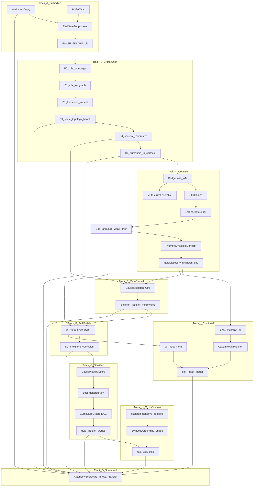
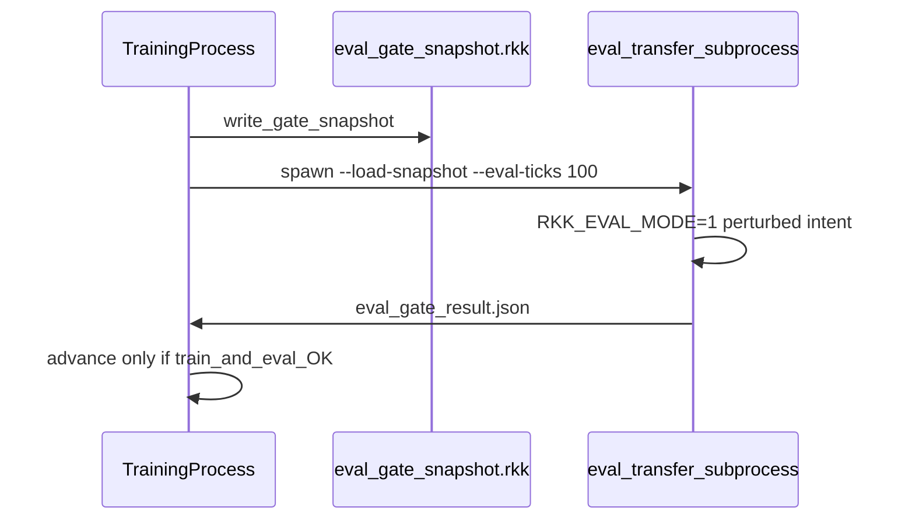
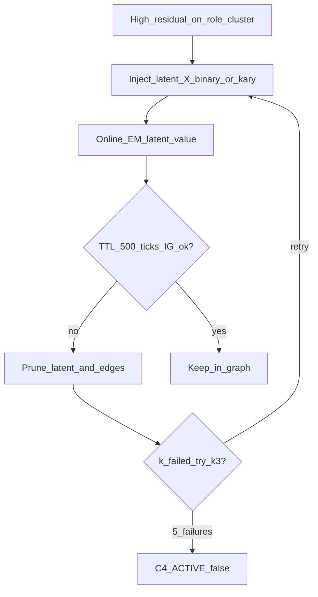

# Roadmap: Track A → I + Scorecard D (полный AGI)

**Track A** — embodied reliability. **B0–B4 + C** — перенос **физического контроля** (роли, спектр, латенты). **E + C4b + F** — выход за «только тело»: метакаузальные инварианты, концепты как do-узлы с языковым weak prior, каузальная метамодель обучения. **G** — автономная генерация целей без human curriculum. **H** — нефизический cross-domain skeleton transfer + символическое заземление. **I** — непрерывное самосовершенствование без катастрофического забывания.

См. [Почему B4/C6 недостаточно](#почему-b4c6-недостаточно-для-нефизического-agi) и [Честный потолок AGI](#честный-потолок-agi).



---

# Track A — Embodied reliability (текущий спринт)

Оценка после A: embodied **4→6**, autonomy **3→4** (within-run transfer only).

## A1. Transfer eval протокол + логи (2–3 дня, первым)

### Терминология

**Within-run transfer test**, не classical held-out: онлайн-обучение, нет checkpoint между независимыми прогонами.

1. Прогон до стадии K (train conditions).
2. В момент K — `RKK_EVAL_MODE=1` (другой `intent_target`, без обучения).
3. Метрики на окне K+1.

Имя в коде/логах: **transfer eval**, не held-out.

**Скрипт:** [`backend/tools/eval_transfer.py`](backend/tools/eval_transfer.py)

| CLI / env | Смысл |
|-----------|--------|
| `--train-stage` K | `fixed_root` / `scope_phase` / `curriculum_step` |
| `--eval-stage` K+1 | Соседний `intent_target` из [`physical_curriculum.py`](backend/engine/physical_curriculum.py) |
| `--pose-seed`, `--agent-seed` | Фикс RNG + `reset_stance()` |
| `--train-ticks` / `--eval-ticks` | Длина фаз |
| `RKK_EVAL_MODE=1` | Подавить `graph.train_step`, distill, trajectory train |
| `RKK_SCORE_ASYNC=0` | В eval-фазе |

**JSONL** `logs/transfer_eval.jsonl`:

| Поле | Определение |
|------|-------------|
| `success_rate` | `posture_stability >= threshold` и не `fallen` |
| `ticks_to_recover` | fallen → N тиков подряд upright (`null` если не падал) |
| `fallen_frac` | доля fallen за eval-окно |
| `eval_kind` | `"within_run_transfer"` |
| + контекст | `train_stage`, `eval_stage`, `fixed_root`, `curriculum_step`, `scope_phase`, `tick` |

**Scorecard (Track D):** тот же скрипт с флагом `--scorecard` — см. [Track D](#track-d--autonomy-scorecard).

---

## A2. Теги в буферах (параллельно, ~0.5–1 день)

| Компонент | Файл | Изменение |
|-----------|------|-----------|
| Trajectory | [`trajectory_contrastive.py`](backend/engine/trajectory_contrastive.py) | per-tick: `fixed_root`, `fallen`, `curriculum_step`, `scope_phase`; в `_finalize`: `fallen_frac`, `fixed_root_frac`, `dominant_stage` |
| Distill | [`controller.py`](backend/engine/system2/controller.py) `_append_distill` | `extra`: те же поля |
| Health | [`distill_log.py`](backend/engine/system2/distill_log.py) | breakdown по `fixed_root` / RECOVER |
| Snapshot | [`snapshot.py`](backend/engine/features/simulation/snapshot.py) | (опционально) те же поля |

**Критично:** [`humanoid_curriculum_step`](backend/engine/features/simulation/snapshot.py) ≠ `ProgressiveScope._phase` — писать **оба**.

---

## A3. Dual-criterion curriculum advance (subprocess, не inline)

**v1 отклонено:** 100-tick eval внутри tick loop (PyBullet save/restore, CPG/agent loops, W/distill/RNG).

**v1 принято:**



| Компонент | Файл | Функции |
|-----------|------|---------|
| Gate API | [`curriculum_eval_gate.py`](backend/engine/curriculum_eval_gate.py) | `write_gate_snapshot`, `run_gate_eval_subprocess` → `EvalResult` |
| Hooks | [`progressive_scope.py`](backend/engine/progressive_scope.py), [`mixin_tick.py`](backend/engine/features/simulation/mixin_tick.py) | перед `_advance_phase` / `_fr_curriculum_finalize_release` |

| Env | Default | Смысл |
|-----|---------|--------|
| `RKK_ADVANCE_EVAL_TICKS` | 100 | длина perturbed eval |
| `RKK_ADVANCE_EVAL_FALLEN_MAX` | — | max `fallen_frac` для pass |
| `RKK_ADVANCE_EVAL_QUALITY_MIN` | — | min quality для pass |

---

## A4. Post-FR: EIG recalibration + адаптация W

| Проблема | Рычаг | Файл |
|----------|--------|------|
| EIG saturation | `RKK_POST_FR_ALPHA_DECAY` + ensemble entropy reset | [`mixin_world.py`](backend/engine/features/simulation/mixin_world.py), [`graph_ensemble.py`](backend/engine/graph_ensemble.py) |
| W misprediction post-release | `RKK_POST_FR_WM_LR_MULT`, `RKK_POST_FR_WM_LR_TICKS` | [`causal_graph._finish_train_step`](backend/engine/causal_graph.py) `lr_scale`; `_post_fr_wm_lr_until` рядом с `_post_fr_explore_until` |

**Не делать:** `RKK_POST_FR_MIN_SCORE_FLOOR` (exploration floor) — костыль.

| Env | Default | Смысл |
|-----|---------|--------|
| `RKK_POST_FR_ALPHA_DECAY` | 0.4 | decay `alpha_trust` на motor/posture/support edges |
| `RKK_POST_FR_WM_LR_MULT` | 2.0–3.0 | boost WM LR после release |
| `RKK_POST_FR_WM_LR_TICKS` | 300–600 | окно boost (согласовать с `RKK_POST_FR_EXPLORE_TICKS`) |

**Логи post-release +300 тиков:** `alpha_mean`, `ensemble.entropy`, top EIG, `discovery_rate`, `post_fr_wm_lr_active`.

---

## Track A — порядок PR

1. `eval_transfer.py` + `RKK_EVAL_MODE` + scorecard hooks  
2. Buffer tags  
3. `curriculum_eval_gate` + dual gate  
4. Post-FR EIG + WM_LR  

---

# Track B — Cross-world transfer

## Структурный потолок B0–B3 (честно)

**B0–B3 работают только при идентичной топологии `role_type`.** Это **interpolation** (другая физика, те же слоты ролей), не generalization across morphology. Для AGI-платформы в смысле RKK нужен **B4** (спектральный перенос) + **C5/C6** (learned roles без pre-labelling).

| Трек | Тип transfer | Топология | Pre-labels |
|------|--------------|-----------|------------|
| B0–B3 | same-role-map | идентична | hand-coded `role_type` |
| B4 | cross-topology | разная (humanoid→cartpole) | **не** нужны совпадающие теги |
| C5–C6 | unknown env | любая | auto-map по fingerprint |

---

## B0. Prerequisite: role-type alignment (B0–B3 only)

**Shared concept store / genome compression бессмысленны без role alignment** — compress нечего переносимого.

### `role_type` на узлах

| Файл | Изменение |
|------|-----------|
| [`causal_graph.py`](backend/engine/causal_graph.py) `CausalNode` | Поле `role_type: str` — не имя узла (`left_hip`), а **роль** |
| [`environment_humanoid.py`](backend/engine/environment_humanoid.py) / variable registry | Стабильный маппинг `var_id → role_type` при `rebind_variables` |
| [`concept_store.py`](backend/engine/concept_store.py) | `concept_*` nodes → `role_type="concept"` |

**Допустимые `role_type` (v1):**

| role_type | Примеры (роль, не имя) |
|-----------|-------------------------|
| `motor` | суставные intent / torque channels |
| `posture` | `posture_stability`, `support_bias`, torso |
| `contact` | foot contact, ground reaction proxies |
| `proprioceptive` | joint angles, velocities |
| `intent` | `intent_*` macros |
| `concept` | `concept_*` из inner voice / bridge |

Тег **стабилен across worlds**: в `humanoid` и `humanoid_variant` один и тот же `role_type` на семантически эквивалентном слоте.

| Env | Смысл |
|-----|--------|
| `RKK_ROLE_TYPE_ENABLED` | 1 — писать/читать role_type |
| `RKK_ROLE_TYPE_STRICT` | 1 — ошибка если var без role |

---

## B1. Второй мир: `humanoid_variant` (interpolation benchmark)

| Файл | Изменение |
|------|-----------|
| [`core/world.py`](backend/engine/core/world.py) | `WORLDS["humanoid_variant"]` |
| NEW [`environment_humanoid_variant.py`](backend/engine/environment_humanoid_variant.py) или preset в PyBullet backend | Те же `variable_ids` + role map; **другая** масса / трение / COM / damping |

**Cartpole** — не для B1; тест **cross-topology** только в [B4](#b4-спектральный-геном-cross-topology-transfer).

| Env | Пример |
|-----|--------|
| `RKK_VARIANT_MASS_SCALE` | 1.3 |
| `RKK_VARIANT_FRICTION_SCALE` | 0.7 |
| `RKK_VARIANT_COM_OFFSET_Z` | ±0.02 |

---

## B2. Genome compression по role-typed подграфу

Опора: Phase 3 [`agi_implementation_plan.md`](.cursor/plans/agi_implementation_plan.md).

**Только** рёбра между узлами с известным `role_type` (подграф ролей, не полная W d×d по именам суставов).

| Файл | Функция |
|------|---------|
| NEW [`backend/engine/genome/compressor.py`](backend/engine/genome/compressor.py) | `extract_role_subgraph(W, role_map) → (R, R)`; SVD/low-rank; `reconstruct_role_prior()` |
| [`genome/priors.py`](backend/engine/genome/priors.py) | `load_genome_role_prior()` при init нового мира |
| [`persistence.py`](backend/engine/persistence.py) | Сохранять `role_type` map в meta |

| Env | Смысл |
|-----|--------|
| `RKK_GENOME_RANK` | rank-k для role-subgraph |
| `RKK_GENOME_MIN_WORLDS` | ≥2 мира в offline batch перед compress |

**Порядок:** B0 role tags → логи W из humanoid + variant → offline compress → init variant из prior.

---

## B3. Cross-env transfer benchmark (метрика Track D #2)

**Протокол:**

1. Train в `humanoid` до `success_rate >= 0.5` (или fixed milestone tick).
2. Сохранить snapshot: role-typed W + genome prior ([`persistent_state.py`](backend/engine/persistent_state.py), [`persistence.py`](backend/engine/persistence.py)).
3. Загрузить в `humanoid_variant` с **той же role-type структурой**, `RKK_EVAL_MODE=1` или ограниченный fine-tune (`RKK_CROSS_ENV_ALLOW_WM_TRAIN=0` по умолчанию).
4. Измерить **тики до `success_rate >= 0.5`** без полного retrain W.

| Метрика | Порог (Track D) | Поле JSONL |
|---------|-----------------|------------|
| Zero/few-shot success | **≥ 40%** `success_rate` за **первые 200 тиков** | `cross_env_success_rate_200`, `ticks_to_success_0_5` |

Реализация: расширение [`eval_transfer.py`](backend/tools/eval_transfer.py) — `--benchmark cross_env_same_topology`, не отдельный бинарник.

---

## B4. Спектральный геном + Procrustes (cross-topology transfer)

**Ответ на комбинаторный взрыв:** прямой subgraph isomorphism по рёбрам — O(2^d). **Спектральное разложение** — O(d³) offline + O(dk²) Procrustes; переносим **динамическую сигнатуру**, не имена узлов.

**Идея:** два домена с похожей иерархией управления (intent → низкоуровневые силы/суставы) дают похожие top-k собственные векторы `W_subgraph @ W_subgraph.T` — даже без совпадающих `role_type` меток.

**Связь с Track E:** B4 переносит **веса** (шаг к cross-topology). E переносит **скелет** (CMI-топология) — принципиально другой масштаб generalization; B4 не заменяет E.

### Модуль [`backend/engine/genome/spectral.py`](backend/engine/genome/spectral.py)

```python
def spectral_fingerprint(W_subgraph: torch.Tensor, k: int) -> torch.Tensor:
    """Top-k eigenvectors of W W^T — fixed (d, k) transferable signature."""
    vals, vecs = torch.linalg.eigh(W_subgraph @ W_subgraph.T)
    return vecs[:, -k:]

def procrustes_align(F_new: torch.Tensor, F_ref: torch.Tensor) -> torch.Tensor:
    """R = argmin ||F_new @ R - F_ref||_F — O(d k²), not combinatorial."""
    # scipy/torch orthogonal Procrustes → permutation/rotation on node ordering
    ...

def align_W_to_fingerprint(W_new: torch.Tensor, fingerprint_ref: torch.Tensor) -> torch.Tensor:
    R = procrustes_align(spectral_fingerprint(W_new, k), fingerprint_ref)
    return apply_node_alignment(W_new, R)
```

| Функция | Назначение |
|---------|------------|
| `spectral_fingerprint` | offline + online сигнатура подграфа |
| `procrustes_align` | выравнивание порядка/базиса узлов |
| `transfer_W_spectral(W_src, W_dst_init, k)` | init `W_dst` из humanoid без hand role map |

**Связь с B2:** role-subgraph compress (B2) — быстрый путь при known roles; B4 — когда ролей нет или топология другая. Genome хранит **и** low-rank role prior (B2), **и** spectral fingerprints (B4).

### Тестовый мир: `cartpole` (только B4)

| Файл | Изменение |
|------|-----------|
| [`core/world.py`](backend/engine/core/world.py) | `WORLDS["cartpole"]` — минимальная среда для cross-topology |
| NEW [`environment_cartpole.py`](backend/engine/environment_cartpole.py) | `d` узлов ≠ humanoid; **без** pre-labelled role_types |

### Benchmark B4 (метрика Track D #2b)

| Протокол | Деталь |
|----------|--------|
| Train | `humanoid` → snapshot W |
| Transfer | `cartpole`: init `W` через `transfer_W_spectral`; **без** совпадающих B0 tags |
| Метрика | `success_rate` за 200 тиков OR ticks-to-threshold; сравнить с random init baseline |

CLI: `eval_transfer.py --benchmark cross_topology_spectral --src humanoid --dst cartpole`

| Env | Default | Смысл |
|-----|---------|--------|
| `RKK_SPECTRAL_K` | 8 | top-k eigenvectors в fingerprint |
| `RKK_SPECTRAL_ALIGN_THRESH` | — | min similarity для принятия alignment |
| `RKK_SPECTRAL_TRANSFER_ENABLED` | 0 | master switch B4 |

**Порог (расширение scorecard):** spectral transfer beat random baseline by ≥ **2×** success_rate@200 OR ≥ **40%** absolute (согласовать с B3).

---

## Track B — порядок PR

1. B0: `role_type` на `CausalNode` + humanoid mapping  
2. B1: `humanoid_variant`  
3. B2: `genome/compressor.py` (role-subgraph)  
4. B3: same-topology benchmark в `eval_transfer.py`  
5. **B4:** `genome/spectral.py` + `cartpole` + `--benchmark cross_topology_spectral`  

---

# Track C — Compositional cognition (переставленные приоритеты)

**C2 первым** — единственный шаг с конкретной gradient-реализацией без open research.

## C2. World bridge as WM loss (ПЕРВЫЙ в Track C)

Сейчас [`world_state_bridge.py`](backend/engine/world_state_bridge.py) логирует `(s_t, a_t, s_{t+1}, labels_{t+1})` в `WorldTransition` — **без** градиента в WM.

| Файл | Изменение |
|------|-----------|
| [`world_state_bridge.py`](backend/engine/world_state_bridge.py) | `predict_concept_logits(state_vec) -> (K,)`; кэш target labels |
| [`causal_graph.py`](backend/engine/causal_graph.py) `_train_step_seq` / `_train_step_legacy` | `L_bridge = CE(pred_labels, observed_labels)` после `do(intent_*)` |
| [`inner_voice_net.py`](backend/engine/inner_voice_net.py) | (опционально) shared head weights |

**Сигнал:** после интервенции предсказанные concept labels ≠ наблюдаемые → рассогласование WM. **Не** LLM, **не** таблица `VISUAL_TO_SEMANTIC` как единственный loss — таблица остаётся для label collection, loss идёт по живым logits.

| Env | Default | Смысл |
|-----|---------|--------|
| `RKK_BRIDGE_LOSS_WEIGHT` | 0.15–0.25 | вес `L_bridge` в `L_total` |
| `RKK_BRIDGE_LOSS_EVERY` | 1 | считать каждый N-й train_step |
| `RKK_WORLD_BRIDGE_FIXED_ROOT` | 0 | не учить bridge loss при pinned pelvis (как сейчас для буфера) |

---

## C1. Skill chains + WM verification (после C2)

| Файл | Изменение |
|------|-----------|
| [`physical_curriculum.py`](backend/engine/physical_curriculum.py) | Подключить `mark_mastered` к tick loop + prerequisites |
| [`system2/controller.py`](backend/engine/system2/controller.py) | Macro chain: subgoal graph из skill_id |
| [`goal_planning.py`](backend/engine/goal_planning.py) / agent imagination | Verify chain step via `propagate` PE threshold |

| Env | Смысл |
|-----|--------|
| `RKK_SKILL_CHAIN_MAX_DEPTH` | max macros в цепочке |
| `RKK_SKILL_CHAIN_PE_MAX` | max PE для принятия шага |

---

## C3. Structural hypotheses над ensemble (частично в коде)

Сейчас [`WeightedGraphEnsemble`](backend/engine/graph_ensemble.py): posterior по **весам гипотез W_k**, не по ориентации v-structure.

| Расширение | Деталь |
|------------|--------|
| v-structure posterior | Для collider triplets `(X, Z, Y)`: гипотезы `X→Z←Y` vs `X←Z→Y`; веса в `log_weights_structure` |
| PC / Meek | Использовать `_structure_learn_tick` в [`causal_graph.py`](backend/engine/causal_graph.py); включить периодический шаг |

| Env | Смысл |
|-----|--------|
| `RKK_STRUCTURE_LEARN_EVERY` | период CMI/orientation (уже в коде — **включить и замерить**) |
| `RKK_VSTRUCTURE_ENSEMBLE_N` | число orientation hypotheses на collider |
| `RKK_LOG_DISCOVERY_SPLIT` | 1 — лог `new_edge` vs `reactivated_edge` (см. Track D #3) |

**Метрика успеха C3:** влияние на `discovery_rate` и долю **новых** рёбер (не реактивация); A/B с `RKK_VSTRUCTURE_ENSEMBLE_N=0` vs `>0`.

---

## C4. Latent confounders — greedy structural patch (не семантика)

**Статус:** детерминированный алгоритм с чёткими stop-условиями (не open-ended «генерация смыслов»). Зависит от **C2** (bridge / WM residual сигнал).

**Принцип:** новый «концепт» = **каузальный узел** (не метка на obs) — структурная заплатка для стабильной ошибки после `do(intent)`. Семантические имена **не обязательны**; см. [C4b](#c4b-концепты-как-каузальные-объекты--языковой-weak-prior).



### 1. Триггер (residual-based)

Мониторить residual в [`world_state_bridge.py`](backend/engine/world_state_bridge.py) + WM PE по **кластеру `role_type`** (после C2 `L_bridge` / prediction error на затронутых узлах).

| Условие | Смысл |
|---------|--------|
| Стабильно высокий residual | Скользящее окно K тиков: mean PE / bridge error > `RKK_LATENT_RESIDUAL_THRESH` на одном `role_type` (или паре role_types) **после** `do(intent_*)` |
| Интерпретация | Сигнал скрытой переменной (do-calculus), не эвристика «странно ведёт себя» |

| Файл | Функция |
|------|---------|
| NEW [`backend/engine/latent_confounder.py`](backend/engine/latent_confounder.py) | `LatentConfounderController.on_tick(sim)` — агрегация residual по role cluster |
| [`world_state_bridge.py`](backend/engine/world_state_bridge.py) | `residual_by_role_cluster() -> dict[role_type, float]` |
| [`causal_graph.py`](backend/engine/causal_graph.py) | PE по узлам с тем же `role_type` |

---

### 2. Инициализация (binary / k-ary latent)

| Шаг | Деталь |
|-----|--------|
| Создать слот | В [`concept_store.py`](backend/engine/concept_store.py) / graph node: `latent_X` (`role_type="latent"`), **без** семантического имени в `CONCEPT_DEFS` |
| Состояние | **Дискретное** `value ∈ {0,…,K-1}`; v1 default **K=2** (бинарный переключатель режима: норма/скользко и т.п.) |
| Не делать | Непрерывный градиент на value — хаос в W и identifiability |

| Env | Default | Смысл |
|-----|---------|--------|
| `RKK_LATENT_MAX_STATES` | 2 | K; при серии TTL-fail на том же кластере → retry с **K=3** (см. §6) |

---

### 3. Маршрутизация рёбер (targeted only)

Рёбра `latent_X → *` только к узлам / `role_types` с **максимальным residual** в окне триггера (top-1 cluster или top-N vars внутри cluster).

| Файл | Функция |
|------|---------|
| [`causal_graph.py`](backend/engine/causal_graph.py) | `add_latent_edges(latent_id, target_var_ids)` — не full connect |
| [`latent_confounder.py`](backend/engine/latent_confounder.py) | `select_targets(residual_map) -> list[var_id]` |

---

### 4. Runtime inference — **обязательный** (закрывает критическую дыру)

Без `latent_X.value` на каждом тике W не может опереть на узел.

**Онлайн-EM / байесовский выбор состояния** (без нового NN-модуля):

```python
# latent_confounder.py — каждый тик, sliding window K_obs
# P(obs_t | latent=s) — Gaussian/log-lik по residual-узлам (оценка из WM или bridge)
log_p[s] = sum(log P(obs_t | latent=s) for obs_t in window)
latent_X.value = argmax_s log_p[s]   # для K=2: 1 if log_p[1] > log_p[0] else 0
```

| Компонент | Деталь |
|-----------|--------|
| Окно | `RKK_LATENT_EM_WINDOW` (default 32) последних наблюдений по target role_types |
| Likelihood | Простая диагональная Gaussian по PE/residual вектору; параметры EMA-обновляются per-state |
| Интеграция | [`agent.py`](backend/engine/agent.py) `step()` / tick: после obs → `LatentConfounderController.infer_state()` → `graph.nodes[latent_X].value` |

---

### 5. TTL-валидация (беспощадный pruning)

| Правило | Деталь |
|---------|--------|
| Испытательный срок | `RKK_LATENT_TTL_TICKS` (default **500**) с момента инъекции |
| Критерий выживания | Information Gain / снижение mean residual на target cluster ≥ `RKK_LATENT_MIN_IG` |
| Fail | Удалить `latent_X`, все рёбра, слот в ConceptStore; лог `latent_pruned` |

| Файл | Функция |
|------|---------|
| [`latent_confounder.py`](backend/engine/latent_confounder.py) | `evaluate_ttl(latent_id) -> bool`; `prune_latent(latent_id)` |
| [`causal_graph.py`](backend/engine/causal_graph.py) | `remove_node_and_edges(latent_id)` |

---

### 6. Hard fallback + k-ary retry

| Сценарий | Действие |
|----------|----------|
| TTL fail на K=2 | **Не** сразу глушить C4: повторить инъекцию на том же role-кластере с `RKK_LATENT_MAX_STATES=3` (один retry) |
| **5** подряд неудачных инъекций (любой K) | `C4_ACTIVE=False` аппаратно; фиксированный словарь `CONCEPT_DEFS`; лог `c4_disabled_reason=inject_failures` |
| Среда не требует латентов | Нормальный исход — не ошибка |

| Env | Default | Смысл |
|-----|---------|--------|
| `RKK_LATENT_TTL_TICKS` | 500 | испытательный срок |
| `RKK_LATENT_MIN_IG` | — | порог IG для pass TTL |
| `RKK_LATENT_MAX_INJECT_FAILURES` | 5 | hard fallback |
| `RKK_LATENT_K_RETRY` | 1 | сколько раз поднять K (2→3) перед счётом failure |

---

### 7. WeightedGraphEnsemble

**Правило:** `latent_X` и его targeted edges добавляются **во все** гипотезы `W_k` **одинаково** ([`graph_ensemble.py`](backend/engine/graph_ensemble.py)).

Иначе posterior по гипотезам несравним; EIG по ensemble ломается.

| Функция | Файл |
|---------|------|
| `ensemble_add_latent_node(latent_id, edges)` | `latent_confounder.py` → sync all `W_stack[i]` |

---

### 8. Env vars (C4)

| Env | Default | Назначение |
|-----|---------|------------|
| `RKK_C4_ENABLED` | 0 | master switch (`C4_ACTIVE` runtime) |
| `RKK_LATENT_RESIDUAL_THRESH` | — | триггер residual |
| `RKK_LATENT_EM_WINDOW` | 32 | окно online-EM |
| `RKK_LATENT_MAX_STATES` | 2 | K (2→3 retry) |
| `RKK_LATENT_TTL_TICKS` | 500 | TTL |
| `RKK_LATENT_MIN_IG` | — | pass TTL |
| `RKK_LATENT_MAX_INJECT_FAILURES` | 5 | hard fallback |
| `RKK_LATENT_K_RETRY` | 1 | k-ary escalation |

**Метрики в snapshot:** `c4_active`, `latent_nodes_alive`, `latent_injections`, `latent_pruned`, `latent_em_state`, `c4_disabled`.

---

### C4 — что НЕ делать

- LLM **как оракул** (обязательные labels, teacher distillation)
- Полносвязные рёбра от латента
- Непрерывный `latent_X.value` через backprop
- Добавление латента только в MAP-гипотезу ensemble

---

### C4b. Концепты как каузальные объекты + языковой weak prior

**Разрыв:** `concept_balance` в `ConceptStore` — метка на наблюдении. AGI требует переменной в графе с **do-calculus** наравне с `intent_*` / motor. C4 уже почти это; C4b добавляет **опциональный** языковой prior для EM.

| Правило | Деталь |
|---------|--------|
| `latent_X` в графе | Участвует в `score_interventions`, `propagate`, targeted edges — **не** только в ConceptStore |
| Язык | Текст из [`verbal_action.py`](backend/engine/verbal_action.py) / S2 context / inner voice monologue — **weak supervision** |
| Не оракул | Граф сам проверяет корреляцию текста с EM-состоянием; низкий prior weight → отбрасывается |

```python
# latent_confounder.py — расширение EM
def em_with_language_prior(latent_id, obs_window, text: str | None):
    log_p = em_log_likelihood(obs_window, latent_id)  # физика
    if text and RKK_LATENT_LANG_PRIOR_WEIGHT > 0:
        log_p += lang_prior_weight * text_state_logprob(text, latent_id)  # soft
    return argmax_state(log_p)
```

| Файл | Изменение |
|------|-----------|
| [`latent_confounder.py`](backend/engine/latent_confounder.py) | `text_state_logprob`, `apply_language_weak_prior` |
| [`causal_graph.py`](backend/engine/causal_graph.py) | `latent_*` в списке intervention candidates (`role_type="latent"` \| `"concept_causal"`) |

| Env | Default | Смысл |
|-----|---------|--------|
| `RKK_LATENT_LANG_PRIOR_WEIGHT` | 0.1 | 0 = выключено (чистый C4) |
| `RKK_LATENT_LANG_PRIOR_MIN_CORR` | — | min corr чтобы prior не игнорировался |

**Мост:** физический латент («режим трения») ↔ языковое описание («балансирует на одной ноге») без полного language grounding.

---

## C5. Промоция латентов → universal learned roles

**Зависимости:** C4 (живые `latent_X`), B4 (multi-world), желательно B1 + cartpole.

C4 — **заплатка для одного run**. C5 — если **тот же** латентный паттерн (fingerprint + targeted edges signature) **выживает TTL в N≥2 средах** → это не run-local patch, а **универсальный концепт**.

| Файл | Функция |
|------|---------|
| [`latent_confounder.py`](backend/engine/latent_confounder.py) | `promote_to_universal_concept(latent_id, survival_worlds: list[str])` |
| [`causal_graph.py`](backend/engine/causal_graph.py) | `convert_latent_to_role_type(latent_id) -> role_type` |
| [`genome/priors.py`](backend/engine/genome/priors.py) | `register_learned_role(LearnedRole)` — fingerprint + edges template |

```python
# latent_confounder.py — после TTL pass в каждой среде
def promote_to_universal_concept(latent_id, survival_worlds):
    if len(survival_worlds) < RKK_PROMOTE_MIN_WORLDS:
        return None
    sig = cluster_signature(latent_id)  # EM state hist + edge targets + spectral slice
    role = graph.convert_latent_to_role_type(latent_id)
    role.role_type = f"learned_{sig[:8]}"
    genome.register_learned_role(role)
    return role
```

**Эффект:** hand-coded `role_type="motor"` (B0) со временем **дополняется** discovered roles; система открывает роли, не заложенные в B0.

| Env | Default | Смысл |
|-----|---------|--------|
| `RKK_PROMOTE_MIN_WORLDS` | 2 | N сред для промоции |
| `RKK_PROMOTE_SIGNATURE_MATCH` | — | min similarity между runs |
| `RKK_C5_ENABLED` | 0 | master switch |

**Метрики:** `learned_roles_count`, `promoted_latents`, `hand_vs_learned_role_fraction`.

---

## C6. Role discovery в незнакомой среде (обратный маппинг)

**Зависимости:** C5 (реестр `genome.learned_roles`), B4 (`spectral_fingerprint`).

В среде **без** pre-labelling: init `W_new` random → для каждого `learned_role` сравнить `spectral_similarity(W_new_subgraph, learned_role.fingerprint)` → лучшему узлу/кластеру присвоить `role_type`.

| Файл | Функция |
|------|---------|
| NEW [`backend/engine/genome/role_discovery.py`](backend/engine/genome/role_discovery.py) | `discover_roles_in_new_env(W_new, learned_roles) -> dict[node_id, role_type]` |
| [`environment_*.py`](backend/engine/core/world.py) | hook при `rebind_variables` / world load |

```python
# role_discovery.py — при входе в новую среду
W_new = initial_random_W()
assignments = {}
for learned_role in genome.learned_roles:
    sim = spectral_similarity(
        spectral_fingerprint(W_new, k),
        learned_role.fingerprint,
    )
    if sim > RKK_ROLE_DISCOVERY_THRESH:
        best_node = argmax_node_alignment(W_new, learned_role)
        W_new.nodes[best_node].role_type = learned_role.role_type
        assignments[best_node] = learned_role.role_type
```

**Убирает зависимость от pre-labelling** для новых тел: «этот узел — то, что раньше называл balance-control».

| Env | Default | Смысл |
|-----|---------|--------|
| `RKK_ROLE_DISCOVERY_THRESH` | 0.65 | min spectral similarity |
| `RKK_C6_ENABLED` | 0 | master switch |
| `RKK_ROLE_DISCOVERY_TOP_K` | 1 | nodes per learned role |

**Тест:** новая среда (cartpole или 3-й мир) → % узлов с assigned learned role без human labels; WM PE vs no-discovery baseline.

---

## Track C — порядок PR

1. **C2** bridge loss в WM  
2. **C1** skill chains  
3. **C3** v-structure ensemble + discovery split metrics  
4. **C4** `latent_confounder.py` + online-EM + TTL + ensemble sync  
5. **C4b** language weak prior (после C4, опционально verbal/S2)  
6. **C5** `promote_to_universal_concept` (после C4 + multi-world logs)  
7. **C6** `genome/role_discovery.py` (после C5 + B4)  

---

# Track E — Abstract causal templates (метакаузальные инварианты)

**Почему B4 недостаточно:** спектральный fingerprint переносит **веса** динамики тела. AGI в нефизическом смысле требует переноса **принципов организации** — иерархия управления, обратная связь, сохранение — как **топологии**, не как `role_type="motor"`.

| B4 | Track E |
|----|---------|
| `spectral_fingerprint(W)` — числа | `CausalSkeleton` — adjacency + scale + feedback loops |
| Похожая динамика → похожие векторы | Похожая **CMI/d-separation** → похожий **скелет** |
| cartpole, humanoid | + задачи без физики (v1: discrete control, tabular toy; v2: chess-like env stub) |

### Модуль [`backend/engine/genome/meta_invariants.py`](backend/engine/genome/meta_invariants.py)

```python
@dataclass
class CausalSkeleton:
  adjacency: np.ndarray          # directed, unweighted
  scale_structure: str           # e.g. "hierarchical" | "feedback"
  feedback_loops: list[tuple[int,int]]

def extract_causal_skeleton(W, obs_data, role_map=None) -> CausalSkeleton:
    """d-separation + CMI (reuse structure_learn) → граф БЕЗ весов W."""
    ...

def skeleton_similarity(sk_a: CausalSkeleton, sk_b: CausalSkeleton) -> float:
    """Graph edit / motif match on unweighted DAG — not Procrustes on W."""

def transfer_skeleton_to_env(sk_ref: CausalSkeleton, W_init, env) -> torch.Tensor:
    """Seed orientations + candidate edges in new domain; weights learned online."""
```

| Шаг | Деталь |
|-----|--------|
| Extract | Offline из humanoid logs: CMI threshold → skeleton |
| Transfer | `humanoid` → `cartpole` **и** non-embodied toy (e.g. `grid_control` stub) — **без** совпадающих role_types |
| Align | Motif matching: intent→actuator chain, feedback loop count |
| Learn | W weights fit **после** topology prior — не перенос W целиком |

**Связь с C3:** v-structure posterior — локальный; E — **глобальный** переносимый скелет.

| Env | Default | Смысл |
|-----|---------|--------|
| `RKK_SKELETON_CMI_THRESH` | — | порог ребра в skeleton |
| `RKK_SKELETON_TRANSFER_ENABLED` | 0 | master E |
| `RKK_SKELETON_MIN_MOTIF_MATCH` | — | pass transfer benchmark |

### Benchmark E (scorecard #5)

| Протокол | Метрика |
|----------|---------|
| Extract skeleton from humanoid | — |
| Init cartpole **или** `grid_control` from skeleton only | `success_rate@200` vs random topology init |
| Порог | ≥ **30%** absolute OR beat random **≥1.5×** (ниже B4 — harder task) |

CLI: `eval_transfer.py --benchmark skeleton_transfer --dst cartpole|grid_control`

---

# Track F — Meta-causal self-model (`W_meta`)

**Разрыв:** агент моделирует мир, но не **своё обучение**. AGI требует do-calculus над гиперпараметрами learner.

### Архитектура

Отдельный граф **`W_meta`** (или гипотеза `k_meta` в [`WeightedGraphEnsemble`](backend/engine/graph_ensemble.py)) над **мета-переменными**:

| Meta-node | Примеры значений | Наблюдаемый effect |
|-----------|------------------|-------------------|
| `learning_rate_eff` | bucketed from WM LR scale | `train_loss` delta |
| `exploration_rate` | EIG / post_fr explore active | `discovery_rate` |
| `curriculum_phase` | scope phase, FR released | `success_rate` |
| `wm_lr_mult` | post-FR mult | `prediction_error` |

```python
# agent.py / NEW meta_causal.py
# do(learning_rate_eff=low) → predict success_rate next window?
# Counterfactual через тот же propagate(), не grid search AutoML

class MetaCausalGraph:
    def predict_success_given_do(self, meta_intervention: dict) -> float: ...
    def suggest_meta_intervention(self) -> dict: ...  # max EIG on W_meta
```

| Файл | Функция |
|------|---------|
| NEW [`backend/engine/meta_causal.py`](backend/engine/meta_causal.py) | `W_meta` build, update, `do_meta()` |
| [`agent.py`](backend/engine/agent.py) | каждые N тиков: log meta state + outcome → `W_meta` train |
| [`graph_ensemble.py`](backend/engine/graph_ensemble.py) | optional `W_meta` hypothesis synced like C4 latents |

**Не AutoML:** те же `score_interventions` / EIG / ensemble — другой слой переменных.

| Env | Default | Смысл |
|-----|---------|--------|
| `RKK_META_CAUSAL_ENABLED` | 0 | master F |
| `RKK_META_UPDATE_EVERY` | 50 | ticks между meta observations |
| `RKK_META_DO_SAFE` | 1 | only counterfactual in sim, not live LR change until validated |

**Метрики:** `meta_prediction_error`, `success_rate_after_meta_do`, correlation suggested vs applied intervention.

**Зависимости:** стабильный Track A + C2; желательно E (skeleton стабилизирует structure learning перед meta loop).

---

## Track E/F — порядок PR

1. **E** `meta_invariants.py` + skeleton extract + cartpole/grid benchmark  
2. **C4b** (можно параллельно с E)  
3. **F** `meta_causal.py` + `W_meta` в ensemble  
4. Scorecard metrics #5 (skeleton), #6 (meta prediction)

---

# Track G — Autonomous Goal Generation (замена human curriculum)

**Разрыв:** `physical_curriculum.py` — hand-authored; агент сам не генерирует задачи. AGI требует, чтобы система формулировала **новые цели** через каузальное рассуждение, а не ждала человека.

**Принцип:** цель = интервенция `do(X=x*)`, при которой **CausalNoveltyScore** (EIG по неизвестным рёбрам или unexplored `role_type` кластерам) максимален. Нет нейросети, нет RL-reward-шейпинга — тот же `score_interventions`, применённый к **пространству задач**, а не к пространству моторики.

## G1. CausalNoveltyScore

| Файл | Функция |
|------|---------|
| NEW [`backend/engine/goal_generator.py`](backend/engine/goal_generator.py) | `CausalNoveltyScore.score(state) → float` |
| [`causal_graph.py`](backend/engine/causal_graph.py) | expose `edge_discovery_eig()` — уже есть; добавить `role_cluster_entropy()` |

```python
# goal_generator.py
def causal_novelty_score(graph, role_map) -> dict[var_id, float]:
    """EIG по неизвестным рёбрам + ролевая энтропия — без нового NN."""
    eig_map = graph.edge_discovery_eig()          # уже есть
    role_ent = graph.role_cluster_entropy()        # новое: entropy W в кластере role_type
    return {v: eig_map[v] + RKK_GOAL_ROLE_ENT_W * role_ent[v] for v in eig_map}
```

| Env | Default | Смысл |
|-----|---------|--------|
| `RKK_GOAL_ROLE_ENT_W` | 0.3 | вес ролевой энтропии в novelty |
| `RKK_GOAL_GEN_ENABLED` | 0 | master switch G |

## G2. goal_generator.py — самогенерация задач

**Механика:**

1. Каждые `RKK_GOAL_PROPOSE_EVERY` тиков — scan `CausalNoveltyScore`.
2. Высший scorer → предложить **субцель** (новый `intent_target` или `scope_phase` вариант) в `S2Controller` как `self_goal_candidate`.
3. Если `W_meta` (Track F) предсказывает `success_rate > threshold` для данной субцели — принять; иначе отклонить и выбрать второй по рейтингу.
4. Выполненная субцель — записать в `CurriculumGraph` как пройденный узел.

| Файл | Функция |
|------|---------|
| [`goal_generator.py`](backend/engine/goal_generator.py) | `GoalGenerator.propose(graph, w_meta) → GoalCandidate` |
| [`system2/controller.py`](backend/engine/system2/controller.py) | `accept_self_goal(candidate)` в `_apply_planning_step` |
| [`goal_planning.py`](backend/engine/goal_planning.py) | hook для субцелевого imagination |

| Env | Default | Смысл |
|-----|---------|--------|
| `RKK_GOAL_PROPOSE_EVERY` | 200 | тики между предложениями |
| `RKK_GOAL_WMETA_MIN_SUCCESS` | 0.3 | min W_meta predicted success |
| `RKK_GOAL_MAX_ACTIVE` | 3 | очередь активных субцелей |

## G3. CurriculumGraph — самообновляемый DAG задач

**Заменяет** статичный `physical_curriculum.py` — не удалять сразу, но добавить альтернативный путь.

| Файл | Функция |
|------|---------|
| NEW [`backend/engine/curriculum_graph.py`](backend/engine/curriculum_graph.py) | `CurriculumGraph`: nodes = задачи; edges = prerequisites (causal + temporal) |
| [`goal_generator.py`](backend/engine/goal_generator.py) | `register_completed(goal_id)`, `suggest_next(graph)` |
| [`persistence.py`](backend/engine/persistence.py) | Сохранять `CurriculumGraph` в `meta` (pickle-safe) |

```python
# curriculum_graph.py
@dataclass
class CurriculumNode:
    goal_id: str
    intent_target: dict        # do(X=x*) для этой задачи
    source: str                # 'human' | 'generated' | 'transferred'
    success_rate: float
    skeleton_hash: str | None  # связь с Track E

class CurriculumGraph:
    def add_generated_goal(self, node: CurriculumNode, prerequisites: list[str]):
        ...
    def next_frontier(self, current_skills: set[str]) -> list[CurriculumNode]:
        """Topological frontier — задачи, у которых все prereqs пройдены."""
        ...
```

| Env | Default | Смысл |
|-----|---------|--------|
| `RKK_CURRICULUM_GRAPH_ENABLED` | 0 | master: использовать CurrGraph вместо physical_curriculum |
| `RKK_CURRICULUM_GRAPH_HUMAN_SEED` | 1 | сидировать из `physical_curriculum.py` при старте |
| `RKK_CURRICULUM_MAX_GENERATED` | 20 | лимит автогенерированных задач |

## G4. Goal transfer между мирами

**После B4 + C6:** если `GoalCandidate` успешна в humanoid → попробовать перенести в cartpole/humanoid_variant через `role_discovery.py`.

| Файл | Функция |
|------|---------|
| [`goal_generator.py`](backend/engine/goal_generator.py) | `transfer_goal_to_world(goal, src_world, dst_world, role_map)` |
| [`eval_transfer.py`](backend/tools/eval_transfer.py) | `--benchmark goal_transfer` — scorecard #7 |

**Метрика (scorecard #7):** % автогенерированных целей с `success_rate ≥ 0.4` в **двух или более** мирах без переписывания `intent_target` вручную.

| Env | Default | Смысл |
|-----|---------|--------|
| `RKK_GOAL_TRANSFER_ENABLED` | 0 | cross-world goal transfer |
| `RKK_GOAL_TRANSFER_MIN_SUCCESS` | 0.4 | pass threshold |

## Track G — порядок PR

1. `CausalNoveltyScore` + `G1` (зависимость: E — structure learn)
2. `GoalGenerator.propose` + `accept_self_goal` в S2 (зависимость: F — W_meta для фильтрации)
3. `CurriculumGraph` + persistence (зависимость: A gate + B4 worlds)
4. Goal transfer benchmark в `eval_transfer.py`
5. Scorecard metric #7

---

# Track H — Cross-domain non-physical skeleton transfer + Symbolic grounding

**Разрыв после E:** Track E доказывает skeleton transfer на `cartpole` — **физическая** задача с другой размерностью. AGI требует переноса в **нефизические домены**: дискретная навигация, символическое управление, текстовые задачи.

**Разрыв с C4b:** weak language prior связывает текст и физический латент через корреляцию. Это односторонний канал. **Track H добавляет двунаправленный мост**: `CausalSkeleton ↔ пропозициональные правила` — агент может генерировать текстовое описание своей модели мира и принимать правила как soft constraints на skeleton.

## H1. Non-physical domain stubs

**Цель:** минимальные среды без PyBullet, совместимые с `CausalSkeleton` API Track E.

| Среда | Тип | Файл | Переменные |
|-------|-----|------|-----------|
| `grid_nav` | Дискретная сетка 5×5 | NEW [`environment_grid_nav.py`](backend/engine/environment_grid_nav.py) | `pos_x`, `pos_y`, `goal_x`, `goal_y`, `action_dir` (4 значения) |
| `symbolic_control` | Таблица истинности + правила | NEW [`environment_symbolic.py`](backend/engine/environment_symbolic.py) | `rule_{i}` boolean vars, `action_select` discrete |
| `text_task` | Stub: fixed текстовые инварианты | NEW [`environment_text_task.py`](backend/engine/environment_text_task.py) | LLM-free; просто named boolean nodes |

**Ключевое условие:** нет `role_type` меток из B0 — skeleton assigned только через Track E `discover_roles_in_new_env`.

| Env | Default | Смысл |
|-----|---------|--------|
| `RKK_H_GRID_NAV_ENABLED` | 0 | включить `grid_nav` stub |
| `RKK_H_SYMBOLIC_ENABLED` | 0 | включить `symbolic_control` stub |
| `RKK_H_TEXT_TASK_ENABLED` | 0 | включить `text_task` stub |

## H2. Skeleton transfer в нефизические домены

**Протокол (расширение E benchmark):**

1. Извлечь `CausalSkeleton` из humanoid (Track E).
2. `transfer_skeleton_to_env(sk_humanoid, W_init_grid_nav, env=grid_nav)`.
3. Измерить `success_rate@500 steps` vs random topology init в `grid_nav`.

```python
# meta_invariants.py — расширение
def transfer_skeleton_nonphys(
    sk_ref: CausalSkeleton,
    W_init: torch.Tensor,
    env_type: str,           # 'grid_nav' | 'symbolic' | 'text_task'
    role_discovery_map: dict,
) -> torch.Tensor:
    """Мотивирует topology prior без физических role_types."""
    motif_map = match_motifs(sk_ref, env_type)   # intent→actuator chain analogue
    return seed_W_from_motif(W_init, motif_map)
```

| Метрика (scorecard #8) | Порог |
|------------------------|-------|
| `success_rate@500` в `grid_nav` с skeleton prior vs random | ≥ **1.5×** OR ≥ **30%** absolute |
| skeleton similarity between humanoid и grid_nav skeletons | ≥ **0.5** motif match |

## H3. SymbolicGrounding — двунаправленный мост

**Идея:** `CausalSkeleton` (топология) → текстовые правила (для вывода / дебага); и обратно: текстовые soft-constraints → предпочтения в skeleton edges.

```python
# NEW backend/engine/symbolic_grounding.py
class SymbolicGrounding:
    def skeleton_to_rules(self, sk: CausalSkeleton) -> list[str]:
        """'If intent_fwd then pos_x changes' — человеко-читаемые правила из CMI edges."""

    def rules_to_skeleton_prior(
        self, rules: list[str], W_init: torch.Tensor
    ) -> torch.Tensor:
        """Soft prior: boost edge W_ij если правило i→j с p>thresh."""
```

**Это не LLM-оракул** — `skeleton_to_rules` использует только CMI топологию; `rules_to_skeleton_prior` — только soft additive weight, не hard constraint.

| Файл | Функция |
|------|---------|
| NEW [`backend/engine/symbolic_grounding.py`](backend/engine/symbolic_grounding.py) | `SymbolicGrounding` class |
| [`world_state_bridge.py`](backend/engine/world_state_bridge.py) | hook: `apply_symbolic_prior()` при `rebind_variables` |
| [`causal_graph.py`](backend/engine/causal_graph.py) | `add_symbolic_edge_prior(rules_prior)` |

| Env | Default | Смысл |
|-----|---------|--------|
| `RKK_SYMBOLIC_GROUNDING_ENABLED` | 0 | master H3 |
| `RKK_SYMBOLIC_PRIOR_W` | 0.2 | вес soft prior из правил |
| `RKK_SYMBOLIC_RULE_THRESH` | 0.6 | min CMI для генерации правила |

**Метрика (scorecard #8b):** % skeleton rules с verified causal support (CMI > threshold) в ≥2 environments.

## Track H — порядок PR

1. **H1** domain stubs (`grid_nav`, `symbolic_control`) + registration в `WORLDS`
2. **H2** `transfer_skeleton_nonphys` + benchmark `--benchmark skeleton_nonphys`
3. **H3** `symbolic_grounding.py` + skeleton→rules + rules→prior hook
4. Scorecard metrics #8, #8b
5. `text_task` stub (опционально, последним)

---

# Track I — Continual causal self-improvement

**Разрыв после G + H:** агент генерирует цели и переходит между мирами. При смене среды происходит **catastrophic forgetting** — `W` перезаписывается, learned roles из C5 деградируют. Track F (`W_meta`) предсказывает гиперпараметры, но не замечает, когда сама `W_meta` устарела.

**Три независимых компонента:**

| Компонент | Проблема | Решение |
|-----------|----------|----------|
| **I1** EWC/PackNet-lite | W degrade при смене мира | Elastic Weight Consolidation на role-subgraph (B2) |
| **I2** CausalHealthMonitor | Незаметная деградация W | Авто-диагноз + self-repair trigger |
| **I3** W_meta_meta | W_meta устарела сама | Meta-meta causal node над W_meta accuracy |

## I1. EWC-lite для W — защита role-subgraph

**Идея:** при смене мира (B1/B4/H1) сохранять Fisher Information Matrix по **role-subgraph** рёбрам (B2). При fine-tune в новом мире — добавить EWC penalty на важные рёбра.

```python
# NEW backend/engine/continual_learning.py
class ElasticRoleProtector:
    def compute_fisher(self, W_role_subgraph, obs_buffer) -> torch.Tensor:
        """Diagonal Fisher по ролевым рёбрам — без full Hessian."""

    def ewc_penalty(self, W_current, W_anchor, fisher) -> torch.Tensor:
        """λ * Σ F_i (W_i - W_anchor_i)^2"""

    def apply_packnet_mask(self, W, task_id: str) -> torch.Tensor:
        """Бинарная маска важных рёбер per-task — PackNet-lite."""
```

| Файл | Функция |
|------|---------|
| NEW [`backend/engine/continual_learning.py`](backend/engine/continual_learning.py) | `ElasticRoleProtector` |
| [`causal_graph.py`](backend/engine/causal_graph.py) | `_train_step_seq`: добавить `ewc_penalty` к loss |
| [`genome/compressor.py`](backend/engine/genome/compressor.py) | hook при `cross_world_init`: snapshot Fisher |

| Env | Default | Смысл |
|-----|---------|--------|
| `RKK_EWC_ENABLED` | 0 | master I1 |
| `RKK_EWC_LAMBDA` | 1000 | EWC penalty weight |
| `RKK_EWC_PACKNET` | 0 | включить PackNet маску |
| `RKK_EWC_ROLES_ONLY` | 1 | защищать только role-subgraph рёбра, не весь W |

**Метрика (scorecard #9):** после 3 смен мира (humanoid→variant→cartpole→grid_nav) — `success_rate` в **первом** мире без retrain ≥ **50%** от baseline (до смены). Катастрофическое забывание < 50%.

## I2. CausalHealthMonitor — авто-диагноз деградации

**Проблема:** W деградирует незаметно — EIG падает, discovery_rate → 0, но агент «не знает что не знает».

**Мониторинг:**

```python
# NEW backend/engine/causal_health.py
class CausalHealthMonitor:
    def diagnose(self, snapshot_window: list[dict]) -> HealthReport:
        """
        Симптомы деградации (все из существующих метрик):
        - discovery_new_frac < RKK_HEALTH_DISCOVERY_MIN (C3/D метрика)
        - ensemble.entropy < RKK_HEALTH_ENSEMBLE_MIN_ENT
        - meta_prediction_error > RKK_HEALTH_META_PE_MAX (F метрика)
        - cross_env_success_rate_200 падает > 20% от baseline
        """

    def suggest_repair(self, report: HealthReport) -> RepairAction:
        """
        Ремонт без вмешательства человека:
        - EWC reset (I1) при forgetting
        - alpha_trust decay (A4 EIG recal) при exploration collapse
        - C4 latent re-injection при residual spike
        - W_meta rollback при meta PE > threshold
        """
```

| Файл | Функция |
|------|---------|
| NEW [`backend/engine/causal_health.py`](backend/engine/causal_health.py) | `CausalHealthMonitor` |
| [`agent.py`](backend/engine/agent.py) | каждые `RKK_HEALTH_CHECK_EVERY` тиков: `monitor.diagnose(snapshot_window)` |
| [`mixin_tick.py`](backend/engine/features/simulation/mixin_tick.py) | применить `RepairAction` в tick |

| Env | Default | Смысл |
|-----|---------|--------|
| `RKK_HEALTH_MONITOR_ENABLED` | 0 | master I2 |
| `RKK_HEALTH_CHECK_EVERY` | 100 | тики между диагнозами |
| `RKK_HEALTH_DISCOVERY_MIN` | 0.4 | min `discovery_new_frac` |
| `RKK_HEALTH_ENSEMBLE_MIN_ENT` | 0.2 | min ensemble entropy |
| `RKK_HEALTH_META_PE_MAX` | 0.2 | max meta PE |
| `RKK_HEALTH_REPAIR_DRY_RUN` | 1 | только логировать, не применять (безопасный режим) |

**Метрика (scorecard #9b):** в ≥ 3 прогонах с намеренной деградацией (выключить EIG на 500 тиков) — монитор детектирует событие и предлагает корректное действие в ≥ **70%** случаев.

## I3. W_meta_meta — do-calculus над self-model

**Разрыв:** `W_meta` (Track F) моделирует «как LR влияет на success». Но сама `W_meta` устаревает при смене домена — агент не знает, что его метамодель неточна.

**Решение:** дополнительный **верхний слой** — простой monitor over `W_meta.meta_prediction_error` и `W_meta.age` (тиков с последнего обновления).

```python
# meta_causal.py — расширение Track F
class MetaMetaNode:
    """Один узел над W_meta: отслеживает accuracy W_meta."""
    def observe_meta_error(self, meta_pe: float, meta_age: int):
        self.ema_pe = 0.9 * self.ema_pe + 0.1 * meta_pe

    def should_reset_wmeta(self) -> bool:
        """True если W_meta устарела или PE выше порога."""
        return (
            self.ema_pe > RKK_META_META_PE_RESET_THRESH
            or meta_age > RKK_META_META_AGE_MAX
        )

    def do_suggest(self) -> dict:
        """do(wmeta_reset=True) или do(wmeta_lr_boost=True) через тот же W_meta API."""
```

| Файл | Функция |
|------|---------|
| [`meta_causal.py`](backend/engine/meta_causal.py) | добавить `MetaMetaNode` рядом с `MetaCausalGraph` |
| [`agent.py`](backend/engine/agent.py) | каждые `RKK_META_META_CHECK_EVERY` тиков: `meta_meta.observe + should_reset` |

| Env | Default | Смысл |
|-----|---------|--------|
| `RKK_META_META_ENABLED` | 0 | master I3 |
| `RKK_META_META_PE_RESET_THRESH` | 0.25 | PE порог сброса W_meta |
| `RKK_META_META_AGE_MAX` | 2000 | max тиков без обновления |
| `RKK_META_META_CHECK_EVERY` | 200 | период проверки |

**Метрика (scorecard #10):** после domain switch — `meta_prediction_error` возвращается к baseline ≤ `RKK_HEALTH_META_PE_MAX` в течение ≤ **1000 тиков** (с I3) vs ≥ **3000 тиков** (без I3).

## Track I — порядок PR

1. **I1** `continual_learning.py` + EWC penalty hook в `_train_step_seq` + Fisher snapshot
2. **I2** `causal_health.py` + diagnose + dry-run repair + scorecard integration
3. **I3** `MetaMetaNode` в `meta_causal.py` + W_meta rollback
4. Scorecard metrics #9, #9b, #10
5. Integration test: 3-world continual run с мониторингом

---

# Track D — Autonomy scorecard (10 метрик → 10/10)

**Не отдельный инструмент** — секция [`eval_transfer.py`](backend/tools/eval_transfer.py) (`--scorecard` / всегда в конце прогона).

## Десять метрик (операциональные пороги)

| # | Критерий | Порог | Измерение | Поле / источник |
|---|----------|-------|-----------|-----------------|
| 1 | Текстовая/целевая задача без hand-scripted recovery | S2 override **< 20%** времени recovery **после tick 1000** | distill JSONL | `s2_override_frac` в `_append_distill` extra + агрегация в eval |
| 2a | Смена мира (same topology) без retrain W | **≥ 40%** `success_rate` за **200 тиков** | Track B3 | `cross_env_success_rate_200` |
| 2b | Cross-topology spectral transfer | beat random baseline **≥2×** OR **≥40%** @200 ticks | Track B4 | `cross_topology_spectral_success_200` |
| 3 | Discovery = новое ребро, не переобъяснение | **> 60%** discovery events с `edge_age == 0` (новое) | [`causal_graph.py`](backend/engine/causal_graph.py) | `edge_age_at_activation`, `discovery_new_frac` в snapshot |
| 4 | Fallen override редкий | **< 15%** тиков в `fallen_override` **после tick 800** | [`snapshot.py`](backend/engine/features/simulation/snapshot.py) / mixin_tick | уже есть; добавить `fallen_override_frac_post_800` |
| 5 | Skeleton transfer (non-weight) | ≥ **30%** @200 OR **≥1.5×** vs random topology | Track E | `skeleton_transfer_success_200` |
| 6 | Meta-causal prediction | meta PE **< 0.15** rolling 500 ticks | Track F | `meta_prediction_error` |
| 7 | Автономная генерация целей (без human curriculum) | ≥ **3** самогенерированные цели с `success_rate ≥ 0.4` в ≥ **2** мирах | Track G | `autonomous_goals_crossworld_pass` |
| 8 | Skeleton transfer в нефизический домен (`grid_nav`) | `success_rate@500` ≥ **1.5×** vs random topology init | Track H | `skeleton_nonphys_success_500` |
| 9 | Continual learning — нет катастрофического забывания | После 3 смен мира: `success_rate` в мире 1 ≥ **50%** от baseline | Track I1+I2 | `continual_forgetting_ratio` |
| 10 | Self-repair скорость после domain shift | `meta_prediction_error` ≤ baseline за ≤ **1000 тиков** | Track I3 | `meta_recovery_ticks` |

### D3 — `edge_age` (новая метрика)

При активации/усилении ребра в structure learning:

```python
# causal_graph.py — при add/activate edge
edge_age = ticks_since_first_activation(edge)
discovery_is_new = (edge_age == 0)
```

Логировать в snapshot: `discovery_events`, `discovery_new_frac`.

### Scorecard output

`logs/autonomy_scorecard.json` — одна строка на run:

```json
{
  "pass": false,
  "s2_override_frac_post_1000": 0.31,
  "cross_env_success_rate_200": 0.42,
  "discovery_new_frac": 0.55,
  "fallen_override_frac_post_800": 0.12,
  "thresholds": { ... }
}
```

`pass_core = metrics 1–4` (embodied autonomy). `pass_agi_extended = 1–6` (включает E/F). `pass_agi_full = 1–10` — **все 10 метрик** — честный 10/10.

---

# Explicit non-goals

| Non-goal | Обоснование |
|----------|-------------|
| **Domain randomization до стабильного Track B.3** | Онлайн-градиент W + шум физики = размытие сигнала; DR после cross-env benchmark |
| **LLM как teacher / оракул** | Удалён намеренно; **C4b weak prior** — разрешён (не teacher) |
| **LLM обязательные labels для latents** | C4 = physics-first; язык только optional prior |
| **C4 без TTL / hard fallback** | Раздувание графа и вечные мёртвые узлы |
| **Новый symbolic engine с нуля** | `ConceptStore` слот + `world_bridge` residual + `latent_confounder`; H3 — only soft prior |
| **Cartpole в B0–B3** | Только B4 test; B1 = humanoid_variant (same role map) |
| **Subgraph isomorphism search** | Использовать B4 spectral + Procrustes |
| **Полный language grounding** | C4b = weak prior; H3 = soft rule prior; не arbitrary text→task |
| **Физика → API/код (v1)** | H1 stubs — минимальные; полный code-task bridge — после H3 |
| **Символическая композиция (logic proofs)** | C1/C3 — control-level; H3 — правила как soft prior, не theorem prover |
| **Остановка на «только physical AGI»** | G/H/I добавлены намеренно |
| **Exploration floor (`POST_FR_MIN_SCORE_FLOOR`)** | Костыль; EIG через alpha decay + WM_LR |
| **Full AutoML над LR/architecture** | F = do-calculus over meta-vars, не neural architecture search |
| **Полный full rehearsal / replay buffer** | I1 = EWC-lite на role-subgraph — не хранить все прошлые данные |
| **Human-in-the-loop curriculum (post G3)** | После `CurriculumGraph` — человек только seed, не постоянный оратор |
| **LLM-as-goal-proposer** | G = CausalNoveltyScore + W_meta; LLM не нужен для генерации целей |

---

# Сводная таблица env vars (новые)

| Env | Track | Default | Назначение |
|-----|-------|---------|------------|
| `RKK_EVAL_MODE` | A | 0 | no train/distill |
| `RKK_ADVANCE_EVAL_*` | A | — | eval gate thresholds |
| `RKK_POST_FR_ALPHA_DECAY` | A | 0.4 | EIG recalibration |
| `RKK_POST_FR_WM_LR_MULT` | A | 2.5 | WM adapt post-release |
| `RKK_POST_FR_WM_LR_TICKS` | A | 450 | WM adapt window |
| `RKK_ROLE_TYPE_ENABLED` | B | 1 | role tags |
| `RKK_VARIANT_*` | B | — | variant physics |
| `RKK_GENOME_RANK` | B | 8 | role-subgraph rank |
| `RKK_CROSS_ENV_ALLOW_WM_TRAIN` | B | 0 | strict zero-shot eval |
| `RKK_BRIDGE_LOSS_WEIGHT` | C2 | 0.2 | bridge CE in WM |
| `RKK_STRUCTURE_LEARN_EVERY` | C3 | — | enable + measure |
| `RKK_VSTRUCTURE_ENSEMBLE_N` | C3 | 4 | orientation hypotheses |
| `RKK_C4_ENABLED` | C4 | 0 | latent confounder search |
| `RKK_LATENT_*` | C4 | см. §C4 | residual, EM, TTL, k-ary |
| `RKK_SPECTRAL_*` | B4 | k=8 | cross-topology transfer |
| `RKK_PROMOTE_*` / `RKK_C5_*` | C5 | 2 worlds | latent → learned role |
| `RKK_ROLE_DISCOVERY_*` / `RKK_C6_*` | C6 | — | unknown env mapping |
| `RKK_LATENT_LANG_PRIOR_*` | C4b | 0.1 | weak language prior |
| `RKK_SKELETON_*` | E | — | CausalSkeleton transfer |
| `RKK_META_*` | F | — | W_meta self-model |
| `RKK_GOAL_*` | G | см. §G | goal generation, novelty, curriculum graph |
| `RKK_CURRICULUM_GRAPH_*` | G3 | — | autonomous curriculum DAG |
| `RKK_H_*` | H | 0 | non-physical domain stubs |
| `RKK_SYMBOLIC_*` | H3 | — | symbolic grounding bridge |
| `RKK_EWC_*` | I1 | — | elastic weight consolidation |
| `RKK_HEALTH_*` | I2 | — | causal health monitor |
| `RKK_META_META_*` | I3 | — | W_meta_meta self-repair |
| Scorecard thresholds | D | см. таблицу D | в eval_transfer |

---

# Почему B4/C6/E/F недостаточно для полного AGI

Весь блок **B + C (до E)** переносит **как устроен контроль тела**:

- `role_type`, spectral fingerprints, learned roles — инварианты **физической динамики**
- C4 latent «режим трения» — всё ещё скрытая переменная **симуляции**, не «как устроено явление вообще»

**AGI в нефизическом смысле** требует метакаузальных инвариантов (иерархия, feedback, conservation-like constraints), которые встречаются в физике, дискретном control, социальных системах — **не как `role_type=motor`**, а как **CausalSkeleton**.

Track **E** (топология), **C4b** (язык как weak prior на каузальный узел), **F** (модель собственного обучения) — три разрыва, закрывающие оговорку «только тело».

**Но после E + F остаются три принципиальных разрыва:**

| Разрыв | Что не закрывает E/F | Что закрывает |
|--------|----------------------|---------------|
| Автономия целей | E/F не генерируют задачи — человек даёт `physical_curriculum` | **Track G** |
| Нефизические домены | E доказывает картполь — всё ещё физика | **Track H** (grid_nav, symbolic) |
| Накопление без забывания | Смена мира → W деградирует; W_meta не знает что устарела | **Track I** |

Порог «настоящий AGI» **неизвестен**, но **10/10 по scorecard** — честная операциональная цель.

---

# Честный потолок AGI

### После A + B + C + D (`pass_core`)

- Embodied autonomy измерима; cross-world (B3/B4); self-discovered roles (C5/C6)
- Всё ещё **преимущественно физический** субстрат рассуждения

### После + E + C4b + F (`pass_agi_extended`)

Система **дополнительно** умеет:

| Способность | Трек |
|-------------|------|
| Переносить **структурные принципы** (скелет, не веса) across domains | E |
| Использовать **язык как weak prior** на каузальные латенты, не как команды | C4b |
| **do-calculus над своим обучением** (LR, exploration, curriculum → success) | F |

Это **ближе к философскому AGI**, чем «операционный AGI только для тел». Не гарантия общего интеллекта.

### Вероятный следующий потолок (не в плане v1)

- Полный перенос skeleton в **программные / социальные** домены с валидацией
- Композиционное **символическое** рассуждение поверх skeleton + latents
- Долгий горизонт целей без human curriculum

**Не останавливаемся на скромности «только physical»** — E/F в roadmap; скромность только в **claims**: порог AGI никто не знает.

---

# Ожидаемый прогресс по оценкам (честно)

| После | Scorecard | Что закрывает | Pass level |
|-------|-----------|---------------|------------|
| Track A | 1/10 | embodied eval протокол | — |
| B0–B3 | 2/10 | metric #2a (same-topology xfer) | — |
| B4 | 3/10 | metric #2b (cross-topology spectral) | — |
| C2–C4 | 4/10 | metric #3 (real discovery), metric #4 (fallen fraction) | `pass_core` (1–4) |
| C4b–C6 | 5/10 | discovered roles + language weak prior | — |
| D `pass_core` | **5/10** | metrics 1–4 пройдены | ✅ `pass_core` |
| **E** | 6/10 | metric #5 (skeleton transfer) | — |
| **F** | 7/10 | metric #6 (meta-causal prediction) | ✅ `pass_agi_extended` |
| **G** | 8/10 | metric #7 (autonomous goals cross-world) | — |
| **H** | 9/10 | metric #8 (non-physical domain transfer) | — |
| **I** | **10/10** | metrics #9 + #10 (continual + self-repair) | ✅ `pass_agi_full` |

**Честная оговорка:** `pass_agi_full = 10/10 по scorecard` — операциональный порог, не философская гарантия «AGI решён». Следующий потолок откроют данные и новые домены.

---

# Глобальный порядок (все треки)

| Фаза | Треки | Блокер | Scorecard после |
|------|-------|--------|------------------|
| 1 | A (transfer eval, tags, gate, post-FR) | — | 1/10 |
| 2 | B0–B3 (interpolation) | A | 2/10 |
| 3 | C2 → C1, C3 | A | — |
| 4 | C4 → C4b | C2 | 4/10 `pass_core` |
| 5 | B4, B3 bench | B0, A | 3/10 |
| 6 | C5 → C6 | C4, B4 | 5/10 |
| 7 | **E** (skeleton) | C3 structure learn, B logs | 6/10 |
| 8 | **F** (W_meta) | A stable, C2 | 7/10 `pass_agi_extended` |
| 9 | **G** (goal generation, curriculum graph) | F, B4, E | 8/10 |
| 10 | **H** (non-physical stubs + symbolic grounding) | E, G | 9/10 |
| 11 | **I** (EWC, health monitor, meta-meta) | F, H, multi-world logs | **10/10** `pass_agi_full` |
| 12 | D full scorecard (1–10) | все E/F/G/H/I hooks | ✅ `pass_agi_full` |

**Параллельные пути:**
- C4b — параллельно с E (после C4).
- F — после E желательно, не обязательно после C6.
- I1 (EWC) — можно начинать параллельно с H1 (достаточно B4 multi-world logs).
- I2 (health monitor) — после F (нужна `meta_prediction_error` метрика).
- I3 (W_meta_meta) — только после F и I2.
