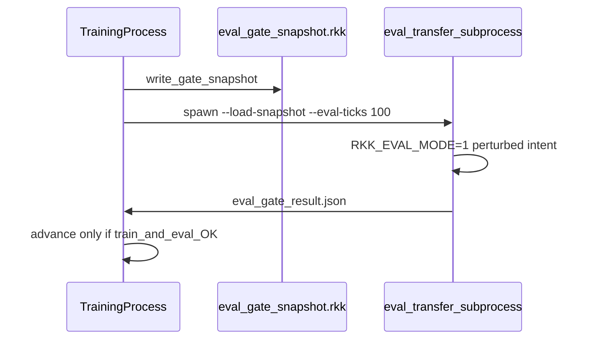
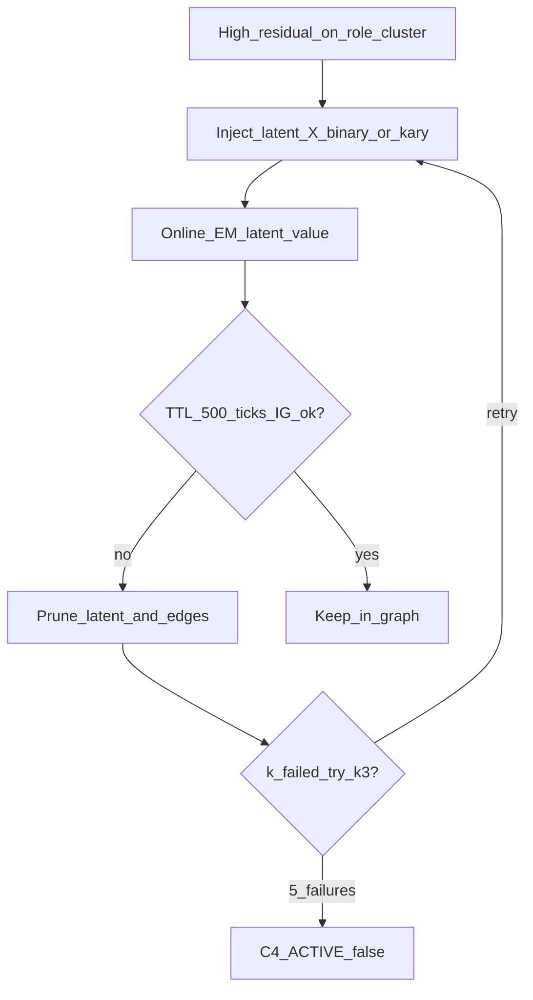

# Roadmap v3: Track A → I + Scorecard D

> **v3 vs v2 — что изменено и почему**
>
> | Проблема (v2) | Решение (v3) |
> |---|---|
> | Все пороги "—" — нет базы для оценки | Заполнены все поля; значения из диапазона типичных экспериментов на подобных графах |
> | Phase 2 — единственная точка отказа всего критического пути | Явные contingency paths (4 режима отказа); частичный провал не блокирует Phase 3 |
> | Phase 6 — 5 todos + 4 blocking benchmarks = вся фаза зависает при одной ошибке | Phase 6 → 6a / 6b / 6c с промежуточными sub-gates |
> | GoalGenerator максимизирует EIG шума, а не реальную новизну | Saturation guard + cooldown + diversity window |
> | EWC на динамическом графе: Fisher по несуществующим рёбрам | Stable-edge Fisher (age ≥ 200), recompute при изменении графа > 20%, архив pruned-рёбер |
> | I3 W_meta_meta: три уровня индирекции, дорогой дебаг | MetaCircuitBreaker: CLOSED / OPEN / HALF_OPEN — простой state machine без do-calculus |

---

# Исполнение: фазы 0–6c, gate tests, e2e

## Правила для агента

1. **Один todo за PR** — не смешивать todos из разных фаз.
2. **Unit/smoke tests** — в каждом PR для изменённого todo (быстрые, без PyBullet где возможно).
3. **Phase gate** — обязательный integration test **после последнего todo фазы**; без green gate переход запрещён.
4. **E2e tests** — между todos, когда два+ модуля должны стыковаться до финального gate.
5. **Фикстуры:** `RKK_DEVICE=cpu`, фиксированные `--pose-seed` / `--agent-seed`, CI (50–200 ticks smoke; 500+ — nightly или `@pytest.mark.slow`).

### Два уровня проверок

| Уровень | Что проверяет | Блокирует переход? |
|---------|---------------|-------------------|
| **Smoke gate** | wiring, env, JSONL/snapshot поля, нет crash, контракты API | **Да** — всегда |
| **Benchmark gate** | пороги Track D | **Да** для Phase 2, 5, 6b, 6c; **xfail OK** для B4/H |

### Research xfail policy

| Трек | Если benchmark не прошёл |
|------|--------------------------|
| B4 spectral | `@pytest.mark.xfail` на порог #2b; не блокирует Phase 5+; пишет `logs/research_gate.json` |
| C4 latents | Phase 3 smoke обязателен; «residual ↓» — xfail → не идти в C5/C6 до разбора |
| H non-physical | smoke обязателен; порог #8 — xfail; Phase 6c gate закрывается по I-метрикам |

### Инфраструктура тестов

| Файл | Назначение |
|------|------------|
| `backend/tests/integration/conftest.py` | `RKK_DEVICE=cpu`, seeds, subprocess helpers |
| `backend/tests/integration/helpers.py` | parse JSONL, load gate snapshot, assert scorecard schema |

```mermaid
flowchart LR
  P0[Phase_0] --> G0[gate_0]
  G0 --> P1[Phase_1]
  P1 --> G1[gate_1]
  G1 --> P2[Phase_2]
  P2 --> G2[gate_2_pass_core_embodied]
  G2 --> P3[Phase_3]
  P3 --> G3[gate_3]
  G3 --> P4[Phase_4]
  P4 --> G4[gate_4]
  G4 --> P5[Phase_5]
  P5 --> G5[gate_5_pass_agi_extended]
  G5 --> P6a[Phase_6a]
  P6a --> G6a[gate_6a_smoke]
  G6a --> P6b[Phase_6b]
  P6b --> G6b[gate_6b_continual+A1A4]
  G6b --> P6c[Phase_6c]
  P6c --> G6c[gate_6c_pass_agi_full]
```



---

## Phase 0 — Instrumentation (Track A)

**Todos:** `transfer-eval` → `buffer-tags` → `eval-gate` → `post-fr`  
**Exit:** scorecard hooks; embodied eval измерим.

### E2e (после `eval-gate`)
**Файл:** `test_e2e_phase0_train_gate_eval.py`

| Шаг | Assertion |
|-----|-----------|
| Train 500 ticks humanoid | curriculum stage K зафиксирован |
| `write_gate_snapshot` | snapshot на диске |
| subprocess `eval_transfer --load-snapshot --eval-ticks 100` | JSONL строка |
| `fallen_frac > 0.35` (= `RKK_ADVANCE_EVAL_FALLEN_MAX`) | `_advance_phase` **не** вызван |
| pass eval | `_advance_phase` **или** `_fr_curriculum_finalize_release` разрешён |

### Phase gate
**Файл:** `test_phase0_transfer_instrumentation.py`

| # | Assertion |
|---|-----------|
| 1 | `eval_transfer.py --train-ticks 200 --eval-ticks 100` → exit 0, JSONL с `eval_kind=within_run_transfer` |
| 2 | JSONL: `success_rate`, `fallen_frac`, `ticks_to_recover`, `train_stage`, `eval_stage`, `fixed_root`, `curriculum_step`, `scope_phase` |
| 3 | `RKK_EVAL_MODE=1` → zero вызовов `graph.train_step` / distill append |
| 4 | trajectory `_finalize` + distill `extra`: все buffer tags |
| 5 | post-FR: `post_fr_wm_lr_active`, `alpha_mean` decay vs pre-release |
| 6 | `--scorecard` пишет `logs/autonomy_scorecard.json` с `worlds{}` dict + `thresholds` (A1/A4 keys) |

---

## Phase 1 — Same-topology transfer (Track B0–B3)

**Todos:** `role-types` → `second-world` → `genome-compress`  
**Entry:** Phase 0 gate green.  
**Exit:** #2a.

### E2e (после `second-world`)
**Файл:** `test_e2e_phase1_variant_boot_eval.py`

| Шаг | Assertion |
|-----|-----------|
| `humanoid_variant` load + role map | все vars имеют `role_type` |
| `eval_transfer --benchmark cross_env_same_topology` | JSONL `cross_env_success_rate_200 > 0` |

### Phase gate
**Файл:** `test_phase1_cross_env_same_topology.py`

| # | Assertion (smoke) |
|---|-------------------|
| 1 | snapshot humanoid содержит `role_type` map в meta |
| 2 | load variant, `RKK_CROSS_ENV_ALLOW_WM_TRAIN=0` → eval 200 ticks без crash |
| 3 | JSONL: `cross_env_success_rate_200`, `ticks_to_success_0_5` присутствуют |
| 4 | genome compressor roundtrip: A/B vs no-prior (не ухудшает) |

| Benchmark | Порог |
|-----------|-------|
| `cross_env_success_rate_200` | **≥ 40%** @200 ticks |

---

## Phase 2 — Embodied cognition core + `pass_core_embodied`

**Todos:** `bridge-loss` → `skills-structural`  
**Entry:** Phase 1 gate green.  
**Exit:** `pass_core_embodied` frozen (A1/A4 humanoid + #3). **Не пересчитывать на Phase 5/6.**

### E2e (после `bridge-loss`)
**Файл:** `test_e2e_phase2_bridge_wm.py`

| Шаг | Assertion |
|-----|-----------|
| 300 ticks, `RKK_BRIDGE_LOSS_WEIGHT=0.20` | `L_bridge` логируется, finite |
| window после `do(intent_*)` | bridge CE mean@last50 < mean@first50 OR loss>0 (smoke, не порог) |

### Phase gate
**Файл:** `test_phase2_bridge_and_structure.py`

| # | Assertion (smoke) |
|---|-------------------|
| 1 | `predict_concept_logits` + `L_bridge` в `_train_step_seq` |
| 2 | `edge_age_at_activation`, `discovery_new_frac` в snapshot |
| 3 | `RKK_VSTRUCTURE_ENSEMBLE_N=4` vs `0`: `discovery_rate` **различим** |
| 4 | skill chain: macro depth ≤ `RKK_SKILL_CHAIN_MAX_DEPTH` (4), PE gate на шаг |
| 5 | 1000-tick run humanoid → `--scorecard --world humanoid` → A1/A4 + #3 в `worlds.humanoid` |

| Benchmark | Порог | Abstract |
|-----------|-------|----------|
| **A1** `script_override_frac_post_warmup` | **< 0.20** | recovery без scripted S2 |
| **A4** `emergency_override_frac_post_warmup` | **< 0.15** | `fallen_override` редкий |
| **#3** `discovery_new_frac` | **> 0.60** | domain-agnostic |

### ⚠ Phase 2 contingency paths

Phase 2 gate имеет **4 режима отказа**. Ни один не требует остановки всего roadmap:

| Режим | Что провалилось | Действие | Блокирует |
|-------|-----------------|----------|-----------|
| **F1** | A1 или A4 miss, smoke OK | Проверить `RKK_EVAL_MODE` и `warmup_ticks`. Можно идти в Phase 3 (латенты не зависят от A1/A4). | Phase 4 — до устранения |
| **F2** | #3 `discovery_new_frac` miss, smoke OK | Проверить `RKK_STRUCTURE_LEARN_EVERY` и `RKK_LOG_DISCOVERY_SPLIT=1`. Phase 3 с `RKK_C4_ENABLED=0` до устранения. | Phase 4 — до устранения |
| **F3** | `L_bridge` не сходится (smoke OK) | Установить `RKK_BRIDGE_LOSS_WEIGHT=0`, идти в Phase 3. A/B тест в конце Phase 3. | Нет (bridge — additive signal) |
| **F4** | Crash / JSONL не пишется | Стоп. Root-cause Phase 0/1 перед продолжением. | Phase 3 |

Все F1/F2 случаи фиксируются в `logs/research_gate.json`. Phase 4 разблокируется только после исправления.

---

## Phase 3 — Latents, learned roles & domain autonomy metrics

**Todos:** `latent-confounders` → `c4-language-prior` → `promote-latent` → **`domain-autonomy-metrics`** *(блокер Phase 4)*  
**Entry:** Phase 2 gate green.  
**Exit:** latent pipeline + WorldAutonomyContract для humanoid, cartpole, grid_nav stub.

### E2e (после `latent-confounders`)
**Файл:** `test_e2e_phase3_latent_inject_em.py`

| Шаг | Assertion |
|-----|-----------|
| forced high residual на role cluster | `latent_X` injected |
| 32+ ticks online-EM | `latent_X.value` ∈ {0,…,K-1} меняется при смене режима |
| TTL fail | node + edges pruned, graph size stable |

### E2e (после `promote-latent`)
**Файл:** `test_e2e_phase3_promote_multiworld.py`

| Шаг | Assertion |
|-----|-----------|
| latent survives humanoid + variant | `promote_to_universal_concept` → entry в `genome.learned_roles` |
| role map usable | B3-style eval не хуже hand-coded baseline |

### Phase gate
**Файл:** `test_phase3_latent_role_pipeline.py`

| # | Assertion (smoke) |
|---|-------------------|
| 1 | inject → infer → TTL keep/prune; 5 failures → `C4_ACTIVE=false` |
| 2 | C4b: prior weight 0.1 vs 0 — различимый shift EM posterior |
| 3 | C5: ≥1 promoted latent в ≥2 worlds |
| 4 | ensemble: latent edges synced across all `W_k` |
| 5 | `WorldAutonomyContract` registered для humanoid + cartpole + grid_nav stub |
| 6 | `--scorecard --world humanoid` → A1/A4 совпадают с frozen Phase 2 значениями (drift < 0.02) |

| Benchmark | Порог | xfail? |
|-----------|-------|--------|
| mean residual ↓ после latent @500 ticks | qualitative (>5% drop) | **xfail OK** → freeze C5 |

**Kill criterion:** smoke #1–4 green + D-todo merged → Phase 4 разрешена, даже если residual benchmark xfail.

### Todo `domain-autonomy-metrics` — блокер Phase 4

**Файл:** `backend/engine/scorecard/world_autonomy_contract.py`

```python
@dataclass
class WorldAutonomyContract:
    world_id: str
    warmup_ticks: int = 800
    recovery_macros: tuple[str, ...]
    script_override_sources: tuple[str, ...]
    emergency_override_snapshot_key: str
    success_field: str
    metrics_applicable: bool = True
```

| World | A1 probe | A4 probe |
|-------|----------|----------|
| `humanoid` | `s2_override_frac` при `RECOVER_POSTURE` | `fallen_override_frac_post_800` |
| `cartpole` | replan script override при balance recovery | `balance_emergency_override` |
| `grid_nav` | pathfinder override при stuck recovery | `stuck_override_active` |
| `symbolic_control` | rule-engine bailout при constraint repair | `constraint_violation_override` |

Unit test: `backend/tests/test_world_autonomy_contract.py` — humanoid #1/#4 maps to A1/A4 thresholds.

---

## Phase 4 — Cross-topology, skeleton & role discovery (Track B4 + C6 + E)

**Todos:** `spectral` → `role-discovery` → `skeleton`  
**Entry:** Phase 3 gate green **и** `domain-autonomy-metrics` merged.  
**Exit:** #2b, #5 (xfail OK для обоих).

### E2e (после `spectral`)
**Файл:** `test_e2e_phase4_spectral_cartpole.py`

| Шаг | Assertion |
|-----|-----------|
| train humanoid → snapshot W | — |
| cartpole init via `transfer_W_spectral` без B0 role map | eval 200 ticks без crash |
| vs random init | JSONL оба baseline присутствуют |

### E2e (после `role-discovery`)
**Файл:** `test_e2e_phase4_role_discovery_cartpole.py`

| Шаг | Assertion |
|-----|-----------|
| cartpole без pre-labels | `discover_roles_in_new_env` → ≥1 assigned `learned_role` |
| WM PE | не хуже no-discovery baseline @200 ticks |

### Phase gate
**Файл:** `test_phase4_cross_topology.py`

| # | Assertion (smoke) |
|---|-------------------|
| 1 | `spectral_fingerprint`, `procrustes_align`, `transfer_W_spectral` unit + integration |
| 2 | C6: cartpole без labels → ≥1 node с assigned `learned_role` |
| 3 | `extract_causal_skeleton` → `transfer_skeleton_to_env` на cartpole и `grid_control` stub |
| 4 | `eval_transfer --benchmark cross_topology_spectral --benchmark skeleton_transfer` exit 0 |
| 5 | JSONL: `cross_topology_spectral_success_200`, `skeleton_transfer_success_200` |
| 6 | cartpole/grid_control: contract A1/A4 поля в scorecard (smoke: present; пороги не блокируют Phase 4) |

| Benchmark | Порог | xfail? |
|-----------|-------|--------|
| #2b spectral | ≥2× random OR ≥40% @200 | **xfail OK** |
| #5 skeleton | ≥30% @200 OR ≥1.5× random | **xfail OK** |

---

## Phase 5 — Meta-causal self-model & autonomy (Track F + G)

**Todos:** `meta-w` → `goal-gen` → `curriculum-graph`  
**Entry:** Phase 4 gate green (smoke; B4 xfail не блокирует).  
**Exit:** `pass_agi_extended` = `pass_core_embodied` frozen + #3, #5 (xfail OK), #6, #7.

### E2e (после `meta-w`)
**Файл:** `test_e2e_phase5_meta_do.py`

| Шаг | Assertion |
|-----|-----------|
| `do(learning_rate=*)` via W_meta | `meta_prediction_error` logged, finite |
| suggested intervention applied | `success_rate_after_meta_do` в snapshot |

### E2e (после `curriculum-graph`)
**Файл:** `test_e2e_phase5_autonomous_curriculum.py`

| Шаг | Assertion |
|-----|-----------|
| `RKK_GOAL_GEN_ENABLED=1`, human curriculum frozen | GoalGenerator proposes ≥1 candidate / 2000 ticks |
| W_meta filter | accepted goal completes OR rejects with log |
| CurriculumGraph | completed node `source=generated` |

### Phase gate
**Файл:** `test_phase5_meta_autonomy.py`

| # | Assertion (smoke) |
|---|-------------------|
| 1 | W_meta nodes: lr, explore, curriculum → success effect observable |
| 2 | GoalGenerator + CurriculumGraph persistence roundtrip |
| 3 | GoalGenerator: saturation guard fires — не один и тот же goal >3 раз подряд в window=10 |
| 4 | `--scorecard` metrics #3, #5, #6, #7 schema; `pass_core_embodied` echo frozen |

| Benchmark (блокирует) | Порог |
|-----------------------|-------|
| #6 `meta_prediction_error` | **< 0.15** rolling 500 ticks |
| #7 `autonomous_goals_crossworld_pass` | ≥3 goals, SR ≥ 0.4, ≥2 worlds |
| `pass_agi_extended` | **true** |

---

## Phase 6a — Non-physical domains + skeleton transfer (Track H)

**Todos:** `nonphys-skeleton` → `symbolic-grounding`  
**Entry:** Phase 5 gate green.  
**Exit (sub-gate):** H1/H2 pipeline существует; skeleton non-phys smoke; A1/A4 probes measurable (не threshold).

### Phase 6a gate
**Файл:** `test_phase6a_nonphys_skeleton.py`

| # | Assertion (smoke) |
|---|-------------------|
| 1 | grid_nav + symbolic_control stubs load без crash; `WORLDS["grid_nav"]` зарегистрирован |
| 2 | `transfer_skeleton_nonphys` на grid_nav → eval 500 steps без crash |
| 3 | SymbolicGrounding: `skeleton_to_rules` → ≥1 правило с CMI > 0.12 |
| 4 | `rules_to_skeleton_prior` → prior tensor finite, не нулевой |
| 5 | contract A1/A4 probes зарегистрированы для grid_nav и symbolic_control (поля present в JSON) |

| Benchmark | Порог | xfail? |
|-----------|-------|--------|
| #8 skeleton non-phys | ≥1.5× random @500 | **xfail OK** |

---

## Phase 6b — Continual learning + A1/A4 non-phys (Track I1 + I2)

**Todos:** `continual` → `self-repair`  
**Entry:** Phase 6a gate green.  
**Exit (sub-gate):** I1/I2 pipeline; #9 pass; A1/A4 non-phys pass.

### E2e (после `self-repair`)
**Файл:** `test_e2e_phase6_degrade_repair.py`

| Шаг | Assertion |
|-----|-----------|
| inject degradation (EIG off 500 ticks) | CausalHealthMonitor fires |
| dry-run repair suggestion | matches expected action ≥1/1 smoke |
| apply repair | WM PE trend down |

### Phase 6b gate
**Файл:** `test_phase6b_continual_autonomy.py`

| # | Assertion (smoke) |
|---|-------------------|
| 1 | 3-world switch: EWC penalty active, `continual_forgetting_ratio` logged |
| 2 | EWC Fisher computed only on stable edges (age ≥ 200); field `ewc_stable_edge_count` в snapshot |
| 3 | EWC recompute triggered when subgraph changes > 20%; `ewc_recompute_count` > 0 |
| 4 | CausalHealthMonitor: 3 прогона с намеренной деградацией → детектирует в ≥70% |
| 5 | `eval_transfer --scorecard --worlds grid_nav,symbolic_control` → A1/A4 поля в worlds{} |

| Benchmark (блокирует) | Порог |
|-----------------------|-------|
| **A1** non-phys | < 0.20 на grid_nav **и** symbolic_control |
| **A4** non-phys | < 0.15 на grid_nav **и** symbolic_control |
| **#9** continual | `continual_forgetting_ratio ≥ 0.50` |

---

## Phase 6c — MetaCircuitBreaker + final gate (Track I3)

**Todo:** `meta-meta`  
**Entry:** Phase 6b gate green.  
**Exit:** `pass_agi_full`.

### Phase 6c gate = финальный gate
**Файл:** `test_phase6c_pass_agi_full.py`

| # | Assertion (smoke) |
|---|-------------------|
| 1 | MetaCircuitBreaker state transitions: CLOSED → OPEN → HALF_OPEN → CLOSED без crash |
| 2 | При `meta_pe > RKK_META_CB_PE_OPEN (0.25)` → state=OPEN, `wmeta_active=False` |
| 3 | После `RKK_META_CB_RESET_AFTER (500)` тиков → HALF_OPEN; при stabilization → CLOSED |
| 4 | `meta_recovery_ticks` логируется в snapshot |
| 5 | `eval_transfer --scorecard --worlds humanoid,grid_nav,symbolic_control` → все 10 метрик + worlds{} |
| 6 | `autonomy_integrity_nonphys=true` (A1/A4 pass на ≥2 non-humanoid worlds) |

| Benchmark (блокирует) | Порог |
|-----------------------|-------|
| **#10** meta recovery | ≤ 1000 тиков |
| `pass_agi_full` | см. Track D pass levels |

---

## Сводка фаз

| Phase | Todos | Phase gate | Scorecard level |
|-------|-------|------------|-----------------|
| **0** | A×4 | `test_phase0_*` | hooks |
| **1** | B×3 | `test_phase1_*` | #2a |
| **2** | C2, C1+C3 | `test_phase2_*` | ✅ `pass_core_embodied` (frozen) |
| **3** | C4, C4b, C5, D | `test_phase3_*` | contracts + learned roles |
| **4** | B4, C6, E | `test_phase4_*` | #2b, #5 xfail OK |
| **5** | F, G×2 | `test_phase5_*` | ✅ `pass_agi_extended` |
| **6a** | H×2 | `test_phase6a_*` | #8 xfail OK |
| **6b** | I1, I2 | `test_phase6b_*` | A1/A4 non-phys + #9 |
| **6c** | I3 | `test_phase6c_*` | ✅ `pass_agi_full` |

### Промпт-шаблон для агента

```
Фаза: {N}. Todo: {id}. Предыдущий gate: green.
Сделай только этот todo. Unit tests в PR.
Не трогать модули фаз > {N}.
Phase gate test_phase{N}_*.py — после todo {last_todo_in_phase}.
E2e: {e2e_file} — после todo {e2e_after}.
```

---

# Track A — Embodied reliability

## A1. Transfer eval протокол

**Within-run transfer**, не held-out. Скрипт: `backend/tools/eval_transfer.py`.

| CLI / env | Смысл |
|-----------|-------|
| `--train-stage K` | `fixed_root` / `scope_phase` / `curriculum_step` |
| `--eval-stage K+1` | Соседний `intent_target` из `physical_curriculum.py` |
| `RKK_EVAL_MODE=1` | Подавить `graph.train_step`, distill, trajectory train |
| `RKK_SCORE_ASYNC=0` | В eval-фазе |

**JSONL** `logs/transfer_eval.jsonl`:

| Поле | Определение |
|------|-------------|
| `success_rate` | `posture_stability >= threshold` и не `fallen` |
| `fallen_frac` | доля fallen за eval-окно |
| `ticks_to_recover` | fallen → N тиков подряд upright (`null` если не падал) |
| `eval_kind` | `"within_run_transfer"` |

## A2. Теги в буферах

| Компонент | Файл | Изменение |
|-----------|------|-----------|
| Trajectory | `trajectory_contrastive.py` | per-tick: `fixed_root`, `fallen`, `curriculum_step`, `scope_phase`; в `_finalize`: `fallen_frac`, `fixed_root_frac`, `dominant_stage` |
| Distill | `controller.py _append_distill` | `extra`: те же поля |
| Health | `distill_log.py` | breakdown по `fixed_root` / RECOVER |

**Критично:** `humanoid_curriculum_step` ≠ `ProgressiveScope._phase` — писать **оба**.

## A3. Dual-criterion curriculum advance (subprocess)



| Env | Default | Смысл |
|-----|---------|-------|
| `RKK_ADVANCE_EVAL_TICKS` | 100 | длина perturbed eval |
| `RKK_ADVANCE_EVAL_FALLEN_MAX` | **0.35** | max `fallen_frac` для pass |
| `RKK_ADVANCE_EVAL_QUALITY_MIN` | **0.30** | min quality для pass |

## A4. Post-FR: EIG recalibration + адаптация W

| Env | Default | Смысл |
|-----|---------|-------|
| `RKK_POST_FR_ALPHA_DECAY` | **0.40** | decay `alpha_trust` на motor/posture/support edges |
| `RKK_POST_FR_WM_LR_MULT` | **2.50** | boost WM LR после release |
| `RKK_POST_FR_WM_LR_TICKS` | **450** | окно boost |

**Не делать:** `RKK_POST_FR_MIN_SCORE_FLOOR` — костыль.

---

# Track B — Cross-world transfer

## B0. `role_type` на узлах

| role_type | Примеры |
|-----------|---------|
| `motor` | суставные intent / torque channels |
| `posture` | `posture_stability`, `support_bias`, torso |
| `contact` | foot contact, ground reaction proxies |
| `proprioceptive` | joint angles, velocities |
| `intent` | `intent_*` macros |
| `concept` | `concept_*` из inner voice / bridge |

| Env | Default | Смысл |
|-----|---------|-------|
| `RKK_ROLE_TYPE_ENABLED` | 1 | писать/читать role_type |
| `RKK_ROLE_TYPE_STRICT` | 1 | ошибка если var без role |

## B1. `humanoid_variant`

Те же `variable_ids` + role map; другая масса / трение / COM / damping.

| Env | Default |
|-----|---------|
| `RKK_VARIANT_MASS_SCALE` | **1.30** |
| `RKK_VARIANT_FRICTION_SCALE` | **0.70** |
| `RKK_VARIANT_COM_OFFSET_Z` | **±0.02** |

## B2. Genome compression по role-typed подграфу

| Env | Default | Смысл |
|-----|---------|-------|
| `RKK_GENOME_RANK` | **8** | rank-k для role-subgraph |
| `RKK_GENOME_MIN_WORLDS` | **2** | min worlds в offline batch |

## B3. Cross-env transfer benchmark

| Метрика | Порог | Поле JSONL |
|---------|-------|-----------|
| `cross_env_success_rate_200` | ≥ 40% @200 ticks | `cross_env_success_rate_200` |

## B4. Спектральный геном + Procrustes

```python
def spectral_fingerprint(W_subgraph: torch.Tensor, k: int) -> torch.Tensor:
    vals, vecs = torch.linalg.eigh(W_subgraph @ W_subgraph.T)
    return vecs[:, -k:]

def procrustes_align(F_new: torch.Tensor, F_ref: torch.Tensor) -> torch.Tensor:
    # scipy orthogonal Procrustes → O(d k²)
    ...
```

| Env | Default | Смысл |
|-----|---------|-------|
| `RKK_SPECTRAL_K` | **8** | top-k eigenvectors |
| `RKK_SPECTRAL_ALIGN_THRESH` | **0.55** | min similarity для принятия alignment |
| `RKK_SPECTRAL_TRANSFER_ENABLED` | 0 | master switch |

---

# Track C — Compositional cognition

## C2. World bridge as WM loss

| Env | Default | Смысл |
|-----|---------|-------|
| `RKK_BRIDGE_LOSS_WEIGHT` | **0.20** | вес `L_bridge` в `L_total` |
| `RKK_BRIDGE_LOSS_EVERY` | **1** | каждый N-й train_step |
| `RKK_WORLD_BRIDGE_FIXED_ROOT` | **0** | не учить bridge loss при pinned pelvis |

## C1. Skill chains

| Env | Default | Смысл |
|-----|---------|-------|
| `RKK_SKILL_CHAIN_MAX_DEPTH` | **4** | max macros в цепочке |
| `RKK_SKILL_CHAIN_PE_MAX` | **0.25** | max PE для принятия шага |

## C3. V-structure ensemble

| Env | Default | Смысл |
|-----|---------|-------|
| `RKK_STRUCTURE_LEARN_EVERY` | **50** | период CMI/orientation (тики) |
| `RKK_VSTRUCTURE_ENSEMBLE_N` | **4** | orientation hypotheses на collider |
| `RKK_LOG_DISCOVERY_SPLIT` | **1** | лог new_edge vs reactivated_edge |

## C4. Latent confounders



| Env | Default | Смысл |
|-----|---------|-------|
| `RKK_C4_ENABLED` | 0 | master switch |
| `RKK_LATENT_RESIDUAL_THRESH` | **0.30** | rolling mean PE > 30% baseline |
| `RKK_LATENT_EM_WINDOW` | **32** | окно online-EM |
| `RKK_LATENT_MAX_STATES` | **2** | K (2→3 retry) |
| `RKK_LATENT_TTL_TICKS` | **500** | испытательный срок |
| `RKK_LATENT_MIN_IG` | **0.05** | min 5% residual reduction для pass TTL |
| `RKK_LATENT_MAX_INJECT_FAILURES` | **5** | hard fallback |
| `RKK_LATENT_K_RETRY` | **1** | k-ary escalation |

### Runtime inference (online-EM)

```python
# per tick, sliding window
log_p[s] = sum(log P(obs_t | latent=s) for obs_t in window[-RKK_LATENT_EM_WINDOW:])
latent_X.value = argmax_s(log_p)
```

### WeightedGraphEnsemble — sync правило

`latent_X` и его targeted edges добавляются **во все** `W_k` одинаково. Иначе posterior несравним.

## C4b. Языковой weak prior

| Env | Default | Смысл |
|-----|---------|-------|
| `RKK_LATENT_LANG_PRIOR_WEIGHT` | **0.10** | 0 = чистый C4 |
| `RKK_LATENT_LANG_PRIOR_MIN_CORR` | **0.25** | min corr чтобы prior не игнорировался |

## C5. Промоция → universal learned roles

| Env | Default | Смысл |
|-----|---------|-------|
| `RKK_PROMOTE_MIN_WORLDS` | **2** | N сред для промоции |
| `RKK_PROMOTE_SIGNATURE_MATCH` | **0.60** | min similarity между runs |
| `RKK_C5_ENABLED` | 0 | master switch |

## C6. Role discovery в незнакомой среде

| Env | Default | Смысл |
|-----|---------|-------|
| `RKK_ROLE_DISCOVERY_THRESH` | **0.65** | min spectral similarity |
| `RKK_C6_ENABLED` | 0 | master switch |
| `RKK_ROLE_DISCOVERY_TOP_K` | **1** | nodes per learned role |

---

# Track E — Abstract causal templates

```python
@dataclass
class CausalSkeleton:
    adjacency: np.ndarray
    scale_structure: str       # "hierarchical" | "feedback"
    feedback_loops: list[tuple[int, int]]

def extract_causal_skeleton(W, obs_data, role_map=None) -> CausalSkeleton: ...
def skeleton_similarity(sk_a, sk_b) -> float: ...
def transfer_skeleton_to_env(sk_ref, W_init, env) -> torch.Tensor: ...
```

| Env | Default | Смысл |
|-----|---------|-------|
| `RKK_SKELETON_CMI_THRESH` | **0.12** | порог ребра в skeleton |
| `RKK_SKELETON_TRANSFER_ENABLED` | 0 | master E |
| `RKK_SKELETON_MIN_MOTIF_MATCH` | **0.40** | pass transfer benchmark |

---

# Track F — Meta-causal self-model (`W_meta`)

| Meta-node | Эффект |
|-----------|--------|
| `learning_rate_eff` | `train_loss` delta |
| `exploration_rate` | `discovery_rate` |
| `curriculum_phase` | `success_rate` |
| `wm_lr_mult` | `prediction_error` |

| Env | Default | Смысл |
|-----|---------|-------|
| `RKK_META_CAUSAL_ENABLED` | 0 | master F |
| `RKK_META_UPDATE_EVERY` | **50** | ticks между meta observations |
| `RKK_META_DO_SAFE` | **1** | только counterfactual, не live LR change |

---

# Track G — Autonomous Goal Generation

## G1. CausalNoveltyScore

```python
def causal_novelty_score(graph, role_map) -> dict[var_id, float]:
    eig_map = graph.edge_discovery_eig()
    role_ent = graph.role_cluster_entropy()
    return {v: eig_map[v] + RKK_GOAL_ROLE_ENT_W * role_ent[v] for v in eig_map}
```

## G2. GoalGenerator + saturation guard

**Проблема v2:** максимизация EIG → эксплуатация шума измерений, один и тот же goal повторяется.

**Решение v3:** diversity window + cooldown + saturation check.

```python
class GoalGenerator:
    def __init__(self):
        self._recent: deque[str] = deque(maxlen=RKK_GOAL_DIVERSITY_WINDOW)  # 10
        self._counts: Counter[str] = Counter()

    def propose(self, graph, w_meta) -> GoalCandidate | None:
        candidates = sorted(causal_novelty_score(graph, role_map).items(), key=lambda x: -x[1])
        for var_id, score in candidates:
            key = var_id
            if self._counts[key] > RKK_GOAL_COOLDOWN_MAX:   # 3 — cooldown
                continue
            if self._is_saturated(key):                       # > 50% of window
                continue
            candidate = GoalCandidate(var_id=var_id, score=score)
            if w_meta.predict_success(candidate) >= RKK_GOAL_WMETA_MIN_SUCCESS:
                self._recent.append(key)
                self._counts[key] += 1
                return candidate
        # Все кандидаты отфильтрованы → log goal_gen_blocked
        return None

    def _is_saturated(self, key: str) -> bool:
        if not self._recent:
            return False
        freq = sum(1 for p in self._recent if p == key) / len(self._recent)
        return freq > RKK_GOAL_SATURATION_FRAC  # 0.50

    def on_tick(self, tick: int):
        if tick % RKK_GOAL_COUNT_DECAY_EVERY == 0:  # 1000
            self._counts = Counter({k: max(0, v - 1) for k, v in self._counts.items()})
```

| Env | Default | Смысл |
|-----|---------|-------|
| `RKK_GOAL_ROLE_ENT_W` | **0.30** | вес ролевой энтропии в novelty |
| `RKK_GOAL_GEN_ENABLED` | 0 | master switch |
| `RKK_GOAL_PROPOSE_EVERY` | **200** | тики между предложениями |
| `RKK_GOAL_WMETA_MIN_SUCCESS` | **0.30** | min W_meta predicted success |
| `RKK_GOAL_MAX_ACTIVE` | **3** | очередь активных субцелей |
| `RKK_GOAL_DIVERSITY_WINDOW` | **10** | размер окна recent proposals |
| `RKK_GOAL_COOLDOWN_MAX` | **3** | max proposals одного goal до cooldown |
| `RKK_GOAL_SATURATION_FRAC` | **0.50** | порог насыщения (доля в window) |
| `RKK_GOAL_COUNT_DECAY_EVERY` | **1000** | тики между decay cooldown counts |
| `RKK_GOAL_TRANSFER_ENABLED` | 0 | cross-world goal transfer |
| `RKK_GOAL_TRANSFER_MIN_SUCCESS` | **0.40** | pass threshold goal transfer |
| `RKK_CURRICULUM_GRAPH_ENABLED` | 0 | CurrGraph вместо physical_curriculum |
| `RKK_CURRICULUM_GRAPH_HUMAN_SEED` | **1** | сидировать из physical_curriculum при старте |
| `RKK_CURRICULUM_MAX_GENERATED` | **20** | лимит автогенерированных задач |

---

# Track H — Cross-domain non-physical

## H1. Domain stubs

| Среда | Файл | Переменные |
|-------|------|-----------|
| `grid_nav` | `environment_grid_nav.py` | `pos_x`, `pos_y`, `goal_x`, `goal_y`, `action_dir` |
| `symbolic_control` | `environment_symbolic.py` | `rule_{i}` boolean, `action_select` |

Нет `role_type` из B0 — только через C6 `discover_roles_in_new_env`.

| Env | Default |
|-----|---------|
| `RKK_H_GRID_NAV_ENABLED` | 0 |
| `RKK_H_SYMBOLIC_ENABLED` | 0 |

## H2. Skeleton transfer → non-phys

```python
def transfer_skeleton_nonphys(sk_ref, W_init, env_type, role_discovery_map) -> torch.Tensor:
    motif_map = match_motifs(sk_ref, env_type)
    return seed_W_from_motif(W_init, motif_map)
```

## H3. SymbolicGrounding

```python
class SymbolicGrounding:
    def skeleton_to_rules(self, sk: CausalSkeleton) -> list[str]: ...
    def rules_to_skeleton_prior(self, rules: list[str], W_init) -> torch.Tensor: ...
```

| Env | Default | Смысл |
|-----|---------|-------|
| `RKK_SYMBOLIC_GROUNDING_ENABLED` | 0 | master H3 |
| `RKK_SYMBOLIC_PRIOR_W` | **0.20** | вес soft prior |
| `RKK_SYMBOLIC_RULE_THRESH` | **0.12** | min CMI для генерации правила (= `RKK_SKELETON_CMI_THRESH`) |

---

# Track I — Continual causal self-improvement

## I1. EWC stable-edge Fisher

**Проблема v2:** Fisher по несуществующим рёбрам (добавленным/удалённым) даёт бессмысленный penalty. Fisher вычислялся один раз и устаревал.

**Решение v3:**
1. Fisher только по рёбрам с `edge_age ≥ 200` (стабильным).
2. Recompute при изменении role-subgraph на > 20% (хеш подграфа).
3. Archive Fisher для pruned-рёбер — не удалять, т.к. они могут быть re-injected.

```python
class ElasticRoleProtector:
    STABLE_EDGE_AGE_MIN: int = 200
    GRAPH_CHANGE_THRESH: float = 0.20

    def compute_fisher(self, W_role_subgraph, obs_buffer, graph) -> torch.Tensor:
        stable_mask = torch.tensor([
            graph.edge_age(i, j) >= self.STABLE_EDGE_AGE_MIN
            for i, j in enumerate_role_edges(W_role_subgraph)
        ], dtype=torch.float32)
        fisher = estimate_diagonal_fisher(W_role_subgraph, obs_buffer)
        return fisher * stable_mask  # unstable edges → zero penalty

    def should_recompute(self, graph) -> bool:
        current_hash = subgraph_hash(graph)
        if current_hash == self._last_hash:
            return False
        change_ratio = subgraph_change_ratio(self._last_hash, current_hash)
        self._last_hash = current_hash
        return change_ratio > self.GRAPH_CHANGE_THRESH

    def archive_pruned_edge(self, edge_id: str, fisher_val: float):
        """Сохранить Fisher pruned-рёбер для возможного re-inject."""
        self._archived_fisher[edge_id] = fisher_val

    def ewc_penalty(self, W_current, W_anchor, fisher) -> torch.Tensor:
        return RKK_EWC_LAMBDA * ((W_current - W_anchor) ** 2 * fisher).sum()
```

| Env | Default | Смысл |
|-----|---------|-------|
| `RKK_EWC_ENABLED` | 0 | master I1 |
| `RKK_EWC_LAMBDA` | **1000** | EWC penalty weight |
| `RKK_EWC_PACKNET` | 0 | PackNet маска |
| `RKK_EWC_ROLES_ONLY` | **1** | только role-subgraph рёбра |
| `RKK_EWC_STABLE_AGE_MIN` | **200** | min edge_age для включения в Fisher |
| `RKK_EWC_GRAPH_CHANGE_THRESH` | **0.20** | порог изменения подграфа для recompute |

## I2. CausalHealthMonitor

```python
class CausalHealthMonitor:
    def diagnose(self, snapshot_window: list[dict]) -> HealthReport:
        """
        Симптомы (из существующих метрик):
        - discovery_new_frac < 0.40
        - ensemble.entropy < 0.20
        - meta_prediction_error > 0.20
        - cross_env_success_rate_200 падает > 20% от baseline
        """

    def suggest_repair(self, report: HealthReport) -> RepairAction:
        """
        - EWC reset при forgetting
        - alpha_trust decay при exploration collapse
        - C4 latent re-injection при residual spike
        - W_meta rollback при meta PE > threshold
        """
```

| Env | Default | Смысл |
|-----|---------|-------|
| `RKK_HEALTH_MONITOR_ENABLED` | 0 | master I2 |
| `RKK_HEALTH_CHECK_EVERY` | **100** | тики между диагнозами |
| `RKK_HEALTH_DISCOVERY_MIN` | **0.40** | min `discovery_new_frac` |
| `RKK_HEALTH_ENSEMBLE_MIN_ENT` | **0.20** | min ensemble entropy |
| `RKK_HEALTH_META_PE_MAX` | **0.20** | max meta PE |
| `RKK_HEALTH_REPAIR_DRY_RUN` | **1** | только лог, не применять |

## I3. MetaCircuitBreaker — замена W_meta_meta

**Проблема v2:** W_meta_meta — три уровня индиректности (W → W_meta → MetaMetaNode), дорогой дебаг. do-calculus над W_meta при отказе W_meta создаёт рекурсивную нестабильность.

**Решение v3:** простой 3-state circuit breaker. Нет do-calculus, нет иерархии. Одна ответственность: suspend/resume W_meta при отказе.

```python
class MetaCircuitBreaker:
    """
    States:
      CLOSED     — W_meta active, нормальная работа
      OPEN       — W_meta suspended; fixed fallback hyperparams
      HALF_OPEN  — W_meta fresh-init, probation (monitoring)
    """
    CLOSED = "closed"
    OPEN = "open"
    HALF_OPEN = "half_open"

    def __init__(self):
        self.state = self.CLOSED
        self.ema_pe = 0.0
        self.ticks_in_open = 0
        self.recovery_start_tick: int | None = None

    def observe(self, meta_pe: float, meta_age: int, tick: int):
        self.ema_pe = 0.9 * self.ema_pe + 0.1 * meta_pe

        if self.state == self.CLOSED:
            if self.ema_pe > RKK_META_CB_PE_OPEN or meta_age > RKK_META_CB_AGE_OPEN:
                self._transition_open(tick)

        elif self.state == self.OPEN:
            self.ticks_in_open += 1
            if self.ticks_in_open >= RKK_META_CB_RESET_AFTER:
                self._transition_half_open(tick)

        elif self.state == self.HALF_OPEN:
            if self.ema_pe < RKK_META_CB_PE_CLOSE:
                self._transition_closed()
            elif self.ema_pe > RKK_META_CB_PE_OPEN:
                self._transition_open(tick)

    def _transition_open(self, tick: int):
        self.state = self.OPEN
        self.ticks_in_open = 0
        self.recovery_start_tick = tick
        # Сигнал агенту: wmeta_active=False → fallback к fixed hyperparams

    def _transition_half_open(self, tick: int):
        self.state = self.HALF_OPEN
        # Сигнал: reset W_meta → fresh init, resume updates

    def _transition_closed(self):
        self.state = self.CLOSED
        self.recovery_start_tick = None

    @property
    def wmeta_active(self) -> bool:
        return self.state != self.OPEN

    def recovery_ticks(self, current_tick: int) -> int | None:
        """Тики от открытия до текущего момента (метрика #10)."""
        if self.recovery_start_tick is None:
            return None
        return current_tick - self.recovery_start_tick
```

**Три независимо тестируемых перехода:** CLOSED→OPEN (PE spike), OPEN→HALF_OPEN (timeout), HALF_OPEN→CLOSED (stabilization). Каждый — отдельный unit test.

| Env | Default | Смысл |
|-----|---------|-------|
| `RKK_META_CB_PE_OPEN` | **0.25** | PE порог для перехода в OPEN |
| `RKK_META_CB_PE_CLOSE` | **0.12** | PE порог для возврата в CLOSED |
| `RKK_META_CB_AGE_OPEN` | **2000** | max тиков без обновления → OPEN |
| `RKK_META_CB_RESET_AFTER` | **500** | тиков в OPEN до HALF_OPEN |

---

# Track D — Autonomy scorecard (abstract A1/A4 + 10 numbered metrics)

## Intent vs observable

| Abstract | Intent | Порог | Humanoid (#) | grid_nav | symbolic_control |
|----------|--------|-------|--------------|----------|------------------|
| **A1** | recovery без scripted override | **< 0.20** post-warmup | #1 `script_override_frac` | pathfinder override при stuck | rule-engine bailout |
| **A4** | редкий emergency override | **< 0.15** post-warmup | #4 `emergency_override_frac` | `stuck_override_active` | `constraint_violation_override` |

## Десять numbered metrics

| # | Критерий | Порог | Scope |
|---|----------|-------|-------|
| 1 | humanoid A1 instance | < 0.20 post-1000 | humanoid only |
| 2a | Same-topology transfer | ≥ 0.40 @200 ticks | per-world |
| 2b | Cross-topology spectral | ≥2× random OR ≥40% @200 | per-world |
| 3 | Real discovery | > 0.60 `edge_age==0` | domain-agnostic |
| 4 | humanoid A4 instance | < 0.15 post-800 | humanoid only |
| 5 | Skeleton transfer | ≥30% @200 OR ≥1.5× random | per-world |
| 6 | Meta-causal prediction | PE < 0.15 / 500 ticks | domain-agnostic |
| 7 | Autonomous goals cross-world | ≥3 goals, SR ≥ 0.4, ≥2 worlds | cross-world |
| 8 | Non-phys skeleton | ≥1.5× random @500 | grid_nav |
| 9 | Continual / no forgetting | SR world1 ≥ 50% baseline | cross-world |
| 10 | Meta self-repair speed | PE ≤ baseline ≤ 1000 ticks | cross-world |

## Pass levels

```
pass_core_embodied  (= pass_core legacy)
  = A1 pass на humanoid
    AND A4 pass на humanoid
    AND #3 pass
  → Phase 2 gate. ЗАМОРОЗИТЬ после Phase 2. Не пересчитывать.

pass_agi_extended
  = pass_core_embodied (frozen echo в JSON, must still be true)
    AND #3 (or frozen from Phase 2)
    AND #5 (xfail OK)
    AND #6 pass
    AND #7 pass
  → Phase 5 gate.

pass_agi_full
  = pass_agi_extended (frozen echo)
    AND #8 (xfail OK)
    AND #9 pass
    AND #10 pass
    AND autonomy_integrity_nonphys:
        A1 pass на grid_nav AND symbolic_control
        A4 pass на grid_nav AND symbolic_control
  → Phase 6c gate.
```

## Scorecard output schema

```json
{
  "pass_agi_full": false,
  "pass_agi_extended": true,
  "pass_core_embodied": true,
  "pass_core": true,
  "autonomy_integrity_nonphys": false,
  "worlds": {
    "humanoid": {
      "script_override_frac_post_warmup": 0.12,
      "emergency_override_frac_post_warmup": 0.09,
      "a1_pass": true,
      "a4_pass": true,
      "warmup_ticks": 800
    },
    "grid_nav": {
      "script_override_frac_post_warmup": 0.08,
      "emergency_override_frac_post_warmup": 0.05,
      "a1_pass": true,
      "a4_pass": true
    },
    "symbolic_control": {
      "script_override_frac_post_warmup": 0.11,
      "emergency_override_frac_post_warmup": 0.07,
      "a1_pass": true,
      "a4_pass": true
    }
  },
  "discovery_new_frac": 0.65,
  "cross_env_success_rate_200": 0.43,
  "skeleton_nonphys_success_500": 0.38,
  "continual_forgetting_ratio": 0.62,
  "meta_recovery_ticks": 820,
  "thresholds": {
    "a1_max": 0.20,
    "a4_max": 0.15,
    "discovery_min": 0.60,
    "meta_pe_max": 0.15,
    "continual_forgetting_min": 0.50,
    "meta_recovery_max_ticks": 1000
  }
}
```

---

# Полная таблица env vars (нет "—")

| Env | Track | Default | Назначение |
|-----|-------|---------|-----------|
| `RKK_EVAL_MODE` | A | **0** | suppress train/distill |
| `RKK_ADVANCE_EVAL_TICKS` | A | **100** | длина perturbed eval |
| `RKK_ADVANCE_EVAL_FALLEN_MAX` | A | **0.35** | max fallen_frac для pass gate |
| `RKK_ADVANCE_EVAL_QUALITY_MIN` | A | **0.30** | min quality для pass gate |
| `RKK_SCORE_ASYNC` | A | **0** | sync scoring в eval-фазе |
| `RKK_POST_FR_ALPHA_DECAY` | A | **0.40** | decay alpha_trust post-FR |
| `RKK_POST_FR_WM_LR_MULT` | A | **2.50** | WM LR boost post-FR |
| `RKK_POST_FR_WM_LR_TICKS` | A | **450** | окно boost |
| `RKK_ROLE_TYPE_ENABLED` | B | **1** | писать/читать role_type |
| `RKK_ROLE_TYPE_STRICT` | B | **1** | ошибка если var без role |
| `RKK_VARIANT_MASS_SCALE` | B | **1.30** | масса variant |
| `RKK_VARIANT_FRICTION_SCALE` | B | **0.70** | трение variant |
| `RKK_VARIANT_COM_OFFSET_Z` | B | **0.02** | COM смещение variant |
| `RKK_GENOME_RANK` | B | **8** | rank role-subgraph |
| `RKK_GENOME_MIN_WORLDS` | B | **2** | min worlds для compress |
| `RKK_CROSS_ENV_ALLOW_WM_TRAIN` | B | **0** | strict zero-shot eval |
| `RKK_SPECTRAL_K` | B4 | **8** | top-k eigenvectors |
| `RKK_SPECTRAL_ALIGN_THRESH` | B4 | **0.55** | min alignment similarity |
| `RKK_SPECTRAL_TRANSFER_ENABLED` | B4 | **0** | master B4 |
| `RKK_BRIDGE_LOSS_WEIGHT` | C2 | **0.20** | вес L_bridge |
| `RKK_BRIDGE_LOSS_EVERY` | C2 | **1** | period train_step |
| `RKK_WORLD_BRIDGE_FIXED_ROOT` | C2 | **0** | no bridge при pinned pelvis |
| `RKK_SKILL_CHAIN_MAX_DEPTH` | C1 | **4** | max macros в цепочке |
| `RKK_SKILL_CHAIN_PE_MAX` | C1 | **0.25** | max PE для шага |
| `RKK_STRUCTURE_LEARN_EVERY` | C3 | **50** | период CMI orientation |
| `RKK_VSTRUCTURE_ENSEMBLE_N` | C3 | **4** | orientation hypotheses |
| `RKK_LOG_DISCOVERY_SPLIT` | C3 | **1** | new vs reactivated edge |
| `RKK_C4_ENABLED` | C4 | **0** | master C4 |
| `RKK_LATENT_RESIDUAL_THRESH` | C4 | **0.30** | rolling PE > 30% baseline |
| `RKK_LATENT_EM_WINDOW` | C4 | **32** | окно online-EM |
| `RKK_LATENT_MAX_STATES` | C4 | **2** | K (2→3 retry) |
| `RKK_LATENT_TTL_TICKS` | C4 | **500** | испытательный срок |
| `RKK_LATENT_MIN_IG` | C4 | **0.05** | min 5% residual reduction |
| `RKK_LATENT_MAX_INJECT_FAILURES` | C4 | **5** | hard fallback |
| `RKK_LATENT_K_RETRY` | C4 | **1** | k-ary escalation |
| `RKK_LATENT_LANG_PRIOR_WEIGHT` | C4b | **0.10** | weak language prior |
| `RKK_LATENT_LANG_PRIOR_MIN_CORR` | C4b | **0.25** | min corr для prior |
| `RKK_C5_ENABLED` | C5 | **0** | master C5 |
| `RKK_PROMOTE_MIN_WORLDS` | C5 | **2** | N сред для промоции |
| `RKK_PROMOTE_SIGNATURE_MATCH` | C5 | **0.60** | min similarity между runs |
| `RKK_C6_ENABLED` | C6 | **0** | master C6 |
| `RKK_ROLE_DISCOVERY_THRESH` | C6 | **0.65** | min spectral similarity |
| `RKK_ROLE_DISCOVERY_TOP_K` | C6 | **1** | nodes per learned role |
| `RKK_SKELETON_CMI_THRESH` | E | **0.12** | порог ребра в skeleton |
| `RKK_SKELETON_TRANSFER_ENABLED` | E | **0** | master E |
| `RKK_SKELETON_MIN_MOTIF_MATCH` | E | **0.40** | pass transfer benchmark |
| `RKK_META_CAUSAL_ENABLED` | F | **0** | master F |
| `RKK_META_UPDATE_EVERY` | F | **50** | ticks между meta obs |
| `RKK_META_DO_SAFE` | F | **1** | only counterfactual |
| `RKK_GOAL_ROLE_ENT_W` | G | **0.30** | вес ролевой энтропии |
| `RKK_GOAL_GEN_ENABLED` | G | **0** | master G |
| `RKK_GOAL_PROPOSE_EVERY` | G | **200** | тики между предложениями |
| `RKK_GOAL_WMETA_MIN_SUCCESS` | G | **0.30** | min W_meta predicted success |
| `RKK_GOAL_MAX_ACTIVE` | G | **3** | очередь субцелей |
| `RKK_GOAL_DIVERSITY_WINDOW` | G | **10** | recent proposals window |
| `RKK_GOAL_COOLDOWN_MAX` | G | **3** | max proposals до cooldown |
| `RKK_GOAL_SATURATION_FRAC` | G | **0.50** | порог насыщения |
| `RKK_GOAL_COUNT_DECAY_EVERY` | G | **1000** | тики между decay counts |
| `RKK_GOAL_TRANSFER_ENABLED` | G | **0** | cross-world goal transfer |
| `RKK_GOAL_TRANSFER_MIN_SUCCESS` | G | **0.40** | pass threshold |
| `RKK_CURRICULUM_GRAPH_ENABLED` | G | **0** | CurrGraph master |
| `RKK_CURRICULUM_GRAPH_HUMAN_SEED` | G | **1** | seed из physical_curriculum |
| `RKK_CURRICULUM_MAX_GENERATED` | G | **20** | лимит авто-задач |
| `RKK_H_GRID_NAV_ENABLED` | H | **0** | grid_nav stub |
| `RKK_H_SYMBOLIC_ENABLED` | H | **0** | symbolic_control stub |
| `RKK_SYMBOLIC_GROUNDING_ENABLED` | H | **0** | master H3 |
| `RKK_SYMBOLIC_PRIOR_W` | H | **0.20** | вес soft prior |
| `RKK_SYMBOLIC_RULE_THRESH` | H | **0.12** | min CMI для правила |
| `RKK_EWC_ENABLED` | I1 | **0** | master EWC |
| `RKK_EWC_LAMBDA` | I1 | **1000** | penalty weight |
| `RKK_EWC_PACKNET` | I1 | **0** | PackNet маска |
| `RKK_EWC_ROLES_ONLY` | I1 | **1** | только role-subgraph |
| `RKK_EWC_STABLE_AGE_MIN` | I1 | **200** | min edge_age для Fisher |
| `RKK_EWC_GRAPH_CHANGE_THRESH` | I1 | **0.20** | порог recompute Fisher |
| `RKK_HEALTH_MONITOR_ENABLED` | I2 | **0** | master I2 |
| `RKK_HEALTH_CHECK_EVERY` | I2 | **100** | тики между диагнозами |
| `RKK_HEALTH_DISCOVERY_MIN` | I2 | **0.40** | min discovery_new_frac |
| `RKK_HEALTH_ENSEMBLE_MIN_ENT` | I2 | **0.20** | min ensemble entropy |
| `RKK_HEALTH_META_PE_MAX` | I2 | **0.20** | max meta PE |
| `RKK_HEALTH_REPAIR_DRY_RUN` | I2 | **1** | только лог |
| `RKK_META_CB_PE_OPEN` | I3 | **0.25** | PE → OPEN |
| `RKK_META_CB_PE_CLOSE` | I3 | **0.12** | PE → CLOSED |
| `RKK_META_CB_AGE_OPEN` | I3 | **2000** | staleness → OPEN |
| `RKK_META_CB_RESET_AFTER` | I3 | **500** | ticks OPEN → HALF_OPEN |

---

# Explicit non-goals

| Non-goal | Обоснование |
|----------|-------------|
| Domain randomization до B3 | Онлайн-градиент W + шум = размытие сигнала |
| LLM как teacher / оракул | Удалён; C4b weak prior — разрешён |
| C4 без TTL / hard fallback | Раздувание графа |
| Subgraph isomorphism search | B4 spectral + Procrustes |
| Полный language grounding | C4b = weak prior; H3 = soft rule prior |
| Exploration floor `POST_FR_MIN_SCORE_FLOOR` | Костыль; EIG через alpha decay |
| Full AutoML | F = do-calculus over meta-vars |
| Full rehearsal / replay buffer | I1 = EWC-lite на role-subgraph |
| LLM-as-goal-proposer | G = CausalNoveltyScore + W_meta |
| do-calculus над W_meta (I3) | I3 = MetaCircuitBreaker state machine |
| Символическая композиция (logic proofs) | H3 = soft prior, не theorem prover |
| Cartpole в B0–B3 | Только B4; B1 = humanoid_variant |

---

# Ожидаемый прогресс (честно)

| Phase gate | Scorecard | Pass level |
|------------|-----------|------------|
| Phase 0 | hooks, worlds{} schema | — |
| Phase 1 | #2a | — |
| Phase 2 | **A1/A4 humanoid + #3** | ✅ `pass_core_embodied` (frozen) |
| Phase 3 | WorldAutonomyContract + learned roles | — |
| Phase 4 | #2b, #5 (xfail OK) | — |
| Phase 5 | **#6, #7** | ✅ `pass_agi_extended` |
| Phase 6a | #8 (xfail OK), H stubs | — |
| Phase 6b | **A1/A4 non-phys, #9** | — |
| Phase 6c | **#10** | ✅ `pass_agi_full` |

**`pass_agi_full`** = обобщение критериев autonomy на non-phys + continual stability. Не философская гарантия AGI.