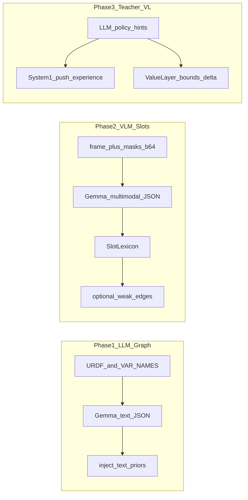

# Трёхфазный план: LLM/VLM bootstrap (Gemma 4 e4b)

## Контекст в коде

- **Точка входа рёбер:** [`RKKAgent.inject_text_priors`](c:\Users\Andrey\Desktop\agi\rkk\backend\engine\agent.py) — уже ожидает `from_`/`to` из `env.variable_ids`, слабые веса и `alpha=0.05`.
- **HTTP:** [`POST /bootstrap/llm`](c:\Users\Andrey\Desktop\agi\rkk\backend\api\server.py) вызывает `RAGSeeder.generate`, но для `humanoid` в [`rag_seeder.py`](c:\Users\Andrey\Desktop\agi\rkk\backend\engine\rag_seeder.py) **нет** `env_topics`; фактически тема сводится к строке `"humanoid"` и Wikipedia даёт мало пользы — **узкое место для Фазы 1**.
- **Ручной бутстрап:** [`humanoid_hardcoded_seeds`](c:\Users\Andrey\Desktop\agi\rkk\backend\engine\environment_humanoid.py) + [`POST /bootstrap/humanoid`](c:\Users\Andrey\Desktop\agi\rkk\backend\api\server.py).
- **Зрение:** слоты `slot_0…`, кэш кадра/масок — [`EnvironmentVisual.get_slot_visualization`](c:\Users\Andrey\Desktop\agi\rkk\backend\engine\environment_visual.py); энкодер — [`CausalVisualCortex.encode`](c:\Users\Andrey\Desktop\agi\rkk\backend\engine\causal_vision.py).
- **Обучение S1:** только [`push_experience(features, actual_ig)`](c:\Users\Andrey\Desktop\agi\rkk\backend\engine\system1.py) из шага агента.
- **VL:** [`HomeostaticBounds`](c:\Users\Andrey\Desktop\agi\rkk\backend\engine\value_layer.py) + `effective_state(tick)` — естественное место для **контекстных** порогов, если добавить слой «надстройки» без ломки инварианта ΔΦ.

---

## Фаза 1 — Эпистемические приоры для гуманоида (LLM → граф)

**Цель:** агент стартует с плотным, физически осмысленным набором рёбер по **реальным** id (`lhip`, `com_z`, `spine_yaw`, `slot_*` в visual mode и т.д.), а не с случайной Wikipedia-статьёй про слово `"humanoid"`.

**Реализация (минимально инвазивно):**

1. **Новый путь генерации** (отдельная функция или метод в `RAGSeeder`, не ломая текущий Wikipedia-пайплайн для physics/chemistry/logic):
   - Вход: `available_vars` из `sim.agent_seed_context()`, опционально **краткий текстовый дайджест** URDF (имена линков/суставов из [`humanoid.urdf`](c:\Users\Andrey\Desktop\agi\rkk\backend\engine\data\humanoid\humanoid.urdf) или список из `environment_humanoid.VAR_NAMES`).
   - Промпт: жёстко требовать **только** JSON-массив рёбер с ключами `from_`, `to`, `weight` в `[-1,1]`, без текста вне JSON (как уже сделано в [`extract_via_llm`](c:\Users\Andrey\Desktop\agi\rkk\backend\engine\rag_seeder.py)).
   - Вызов Ollama: тот же `llm_url` / `llm_model` (`gemma4:e4b`); при необходимости перейти на `/api/chat` с `messages`, если generate-хуже парсится.

2. **API:** расширить [`POST /bootstrap/llm`](c:\Users\Andrey\Desktop\agi\rkk\backend\api\server.py) флагом `mode: "rag_wiki" | "humanoid_structured"` (или отдельный `POST /bootstrap/llm/humanoid`), чтобы не смешивать Wikipedia-темы и структурный промпт.

3. **Валидация:** повторно использовать логику отклонения неизвестных узлов из `inject_text_priors`; опционально пост-фильтр: не более N рёбер на узел-источник, клип весов.

4. **Расширение `humanoid_hardcoded_seeds`:** по желанию — второй шаг после LLM: ручной/полуавтоматический merge «золотого минимума» и вывод LLM (не блокер Фазы 1).

**Критерий готовности:** после `bootstrap` на `humanoid` (и в hybrid visual) в ответе `injected > 0`, мало `skipped`, граф содержит связи суставы↔COM/стопы/торс, совместимые с [`gt_edges`-подобной логикой](c:\Users\Andrey\Desktop\agi\rkk\backend\engine\environment_humanoid.py).

---

## Фаза 2 — Семантика слотов (VLM → лексикон → мост к phys)

**Цель:** `slot_k` перестают быть «чёрными ящиками»; появляется устойчивая **текстовая метка** (и при необходимости слабые гипотезы `slot_i → phys_j` или `slot_i → com_z`).

**Реализация:**

1. **Вход VLM:** данные уже есть в [`get_vision_state`](c:\Users\Andrey\Desktop\agi\rkk\backend\api\server.py) / кэше: `frame` (JPEG base64), `masks` (список JPEG), `slot_values`, `variability` — не нужен второй рендер.

2. **Вызов одной модели (gemma4:e4b):** если Ollama поддерживает изображения в chat — отправить **один** композит: миниатюра кадра + до K миниатюр масок (уже уменьшены в пайплайне) + список имён `slot_0…` и список допустимых `phys_*` / суставов.
   - Ожидаемый ответ: JSON вида `{"slot_0": {"label": "...", "likely_phys": ["lknee"], "confidence": 0.7}, ...}`.

3. **Хранение:** лёгкий объект на стороне [`EnvironmentVisual`](c:\Users\Andrey\Desktop\agi\rkk\backend\engine\environment_visual.py) или отдельный модуль `slot_lexicon.py`: последняя разметка + timestamp + hash кадра; **не** ломать порядок слотов от Hungarian — метки вешаются на **индекс** после стабилизации (или хранить «последняя известная метка для индекса»).

4. **Интеграция с графом (осторожно):**
   - MVP: только UI/API (`GET /vision/slots` расширить полем `slot_labels`).
   - Следующий шаг: `inject_text_priors` с **очень** малыми весами для рёбер `slot_i → phys_*`, если VLM уверен; при конфликте с данными — annealing/NOTEARS выжгут (как задумано для текстовых приоров).

**Критерий готовности:** в visual mode UI показывает подписи слотов; опционально 1–2 проверяемых ребра в граф без деградации стабильности.

---

## Фаза 3 — Виртуальный учитель (S1) + контекстный Value Layer + затухание

**Цель:** ускорить раннюю стабилизацию поведения и смысловые блокировки без «вечной» зависимости от LLM.

**3A. System1 «подсказки»**

- LLM генерирует **короткие** правила в терминах **существующих** `variable_ids` и нормализованных значений (например: «при низком `com_z` не толкать `lhip` сильно»).
- Конвертация в опыт: для кандидатов из [`score_interventions`](c:\Users\Andrey\Desktop\agi\rkk\backend\engine\agent.py) при совпадении с шаблоном подсказки вызывать `push_experience` с **слегка повышенным** `actual_ig` (или отдельный буфер «teacher_prior» с малым весом), либо добавить признак в `features` (расширение размерности `System1Net` — более рискованно).
- **Annealing:** ввести коэффициент `teacher_weight = max(0, 1 - interventions / T_max)` или по фазе из [`simulation.py`](c:\Users\Andrey\Desktop\agi\rkk\backend\engine\simulation.py), чтобы к N интервенциям вклон → 0.

**3B. Value Layer как «этический модуль»**

- Не заменять `HomeostaticBounds` целиком; добавить **дельты** к уже вычисляемому [`EffectiveVLState`](c:\Users\Andrey\Desktop\agi\rkk\backend\engine\value_layer.py) (например ±к `predict_lo`/`predict_hi` или к `env_entropy_max_delta` на короткое окно тиков).
- LLM вход: краткий state-digest (фаза, `fallen`, топ-3 узла по неопределённости, опционально подписи слотов из Фазы 2). Выход: строгий JSON с числовыми полями и TTL тиков.
- Жёсткие инварианты (например разумные клипы, `phi_min` не ниже floor) остаются в коде.

**Связь с byzantine:** [`byzantine.py`](c:\Users\Andrey\Desktop\agi\rkk\backend\engine\byzantine.py) (Causal Motif Transfer) можно **не** трогать в первой итерации Фазы 3; при необходимости позже подставить «донора»-веса из LLM вместо второго агента — отдельный подплан.

**Критерий готовности:** измеримое снижение ранних `blocked`/`fallen` при сохранении сходимости графа; `teacher_weight` → 0 после порога интервенций.

---

## Риски и ограничения

- **Один Gemma 4 e4b:** проверить фактический API Ollama (generate vs chat, поле для images); при отсутствии vision в том же endpoint — Фаза 2 временно через отдельный VLM или только текст + описание масок (хуже).
- **Галлюцинации рёбер:** валидация по `graph.nodes` обязательна; сохранить слабые `alpha` и существующий механизм уточнения весов практикой.
- **Смешение visual/hybrid:** при `variable_ids` с `slot_*` промпт LLM должен явно перечислять оба семейства имён.

---

## Порядок внедрения

Фаза 1 даёт максимум signal/cost; Фаза 2 — UX и мост к физике; Фаза 3 — полировка раннего обучения и безопасности. Рекомендуется не начинать Фазу 3 до стабильной валидации JSON в Фазах 1–2.
