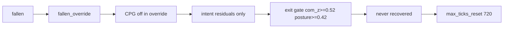
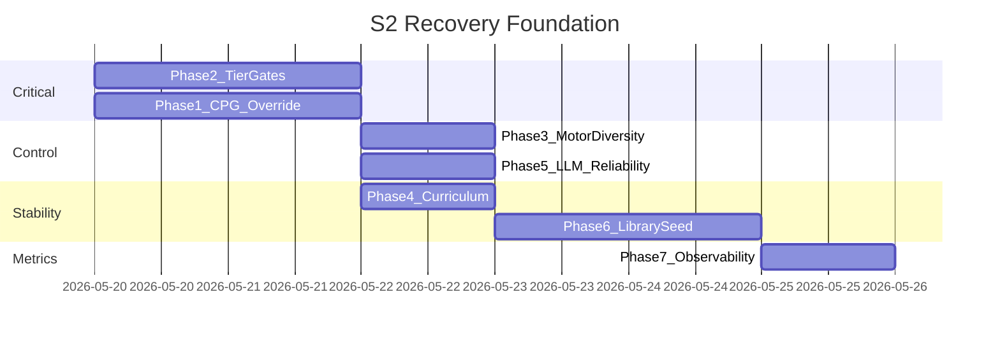

# План: S2 Recovery Foundation (до AGI roadmap)

## Контекст и диагноз

По [system2_distill.jsonl](backend/logs/system2_distill.jsonl) и [rkk_run.jsonl](logs/rkk_run.jsonl):

- Все сессии заканчиваются `max_ticks_reset`, **0%** `recovered`, `distill_recover_success_rate: 0`.
- LLM-планы уже приходят с нормальными `ticks` (30/25/20…), но тело не встаёт.
- Во время override: `cpg_owns_legs: false`, `posture_stability: 0`, `intent_stop_recover ≈ 0.78` в цикле, `s2_wm_score: 0`.

Корневая причина — **не отсутствие Wave B–E**, а разрыв цепочки:



**Критичный баг порогов:** в [.env](.env) `RKK_S2_OVERRIDE_MIN_COM_Z=0.52`, при этом в логе `com_z ≈ 0.06–0.09` на полу. Абсолютный порог **недостижим** для лежачего тела; выход по `override_recovered_posture_ok` практически невозможен ([success_predicates.py](backend/engine/system2/success_predicates.py) L161–198).

**CPG отключён намеренно:** в [mixin_locomotion.py](backend/engine/features/simulation/mixin_locomotion.py) L54–58 при `_s2_override_active` выставляется `cpg_owns_legs = False` и CPG не вызывается — хотя в [cpg_locomotion.py](backend/engine/cpg_locomotion.py) уже есть recovery tuck / walk suppress (`RKK_CPG_RECOVERY_*`).

Уже сделано (не дублировать): деление residual по `ticks`, remediate LLM 1..N, replan без `fallen`, `RKK_S2_DEFER_FALL_HARD_RESET` в [mixin_tick.py](backend/engine/features/simulation/mixin_tick.py).

**Цель пользователя:** поэтапный успех (tiered) — сначала прогресс «с пола», потом полноценная стойка.

---

## Фаза 1 — CPG + ноги во время fallen_override (1–2 дня)

**Проблема:** recovery = только intent-граф; бёдра/колени не получают tuck из CPG.

**Изменения:**

1. [mixin_locomotion.py](backend/engine/features/simulation/mixin_locomotion.py) — вместо `cpg_owns_legs = False; return` при override:
   - Новый флаг `RKK_S2_CPG_DURING_OVERRIDE=1` (default on).
   - Вызывать `_maybe_apply_cpg_locomotion(fallen=True)` с контекстом recovery (или отдельный `_apply_cpg_recovery_override()`).
   - Пробросить в CPG высокий `intent_stop_recover` / `intent_torso_forward` из motor intents для `tuck_gate` (уже используется в cpg_locomotion L294–310).

2. [controller.py](backend/engine/system2/controller.py) — в diag/tick log: `cpg_recovery_active`, `cpg_owns_legs` во время override.

3. [.env](.env) — документировать связку:
   - `RKK_LOCOMOTION_CPG=1` (уже есть)
   - `RKK_S2_CPG_DURING_OVERRIDE=1`
   - при необходимости усилить `RKK_CPG_RECOVERY_HIP_TUCK` / `KNEE_FLEX_EXTRA`

**Критерий:** в `rkk_run.jsonl` при `fallen_override_active` поле `cpg_owns_legs: true` (или явный `cpg_recovery_active`).

**Тест:** unit/mock — override active не сбрасывает `cpg_owns_legs` при `RKK_S2_CPG_DURING_OVERRIDE=1`.

---

## Фаза 2 — Поэтапные критерии выхода (tiered) (1–2 дня)

**Проблема:** единый жёсткий gate; `posture_stability=0` на полу; абсолютный `com_z>=0.52`.

**Изменения в** [success_predicates.py](backend/engine/system2/success_predicates.py):

| Tier | Условие | Назначение |
|------|---------|------------|
| **tier1** `progress` | `not fallen` + улучшение от `obs0`: `d_com_z >= RKK_S2_RECOVER_TIER1_DCOMZ` (default 0.04) **или** `d_posture >= 0.06` + `foot_contact` | Выйти из override, `success:true`, distill `recover_tier: 1` |
| **tier2** `stand` | Текущий `override_recovered_posture_ok`, но **относительный** com_z: `com_z >= obs0.com_z + 0.08` **и** `>= RKK_S2_OVERRIDE_MIN_COM_Z_ABS` (default 0.38, не 0.52) + `posture >= 0.42` | Полный `recovered`, tier 2 |

Новые функции: `override_recovered_tier1_ok(obs, obs0)`, `override_recovered_tier2_ok(obs, obs0)`.

**Изменения в** [controller.py](backend/engine/system2/controller.py) `_maybe_tick_fallen_override` (L1320–1338):

- При `not fallen`: проверять tier2 → tier1 (сначала строже).
- `source_note`: `recovered` (tier2) или `recovered_tier1`.
- В distill extra: `recover_tier`, `override_exit_block` из diag.

**Изменения в** [.env](.env):

- Снизить/переопределить `RKK_S2_OVERRIDE_MIN_COM_Z` → разделить на `RKK_S2_OVERRIDE_MIN_COM_Z_ABS` и delta-пороги tier1/2.
- `RKK_S2_RECOVER_TIER1_DCOMZ=0.04`, `RKK_S2_RECOVER_TIER2_DCOMZ=0.08`.

**Критерий:** в новом прогоне ≥1 строка distill с `ending_source: fallen_override:recovered_tier1` или `recovered` и `success: true` за 3–5 падений.

**Тест:** [backend/tests/test_recovery_schedule_a_plus.py](backend/tests/test_recovery_schedule_a_plus.py) или новый `test_recovery_tier_gates.py` — prone obs0 → kneel obs1 проходит tier1, не tier2.

---

## Фаза 3 — Разнообразие motor control в override (1 день)

**Проблема:** зацикливание на `intent_stop_recover=0.78` ([controller.py](backend/engine/system2/controller.py) graph_patch L1064–1067 + WM priority L484–491).

**Изменения:**

1. Снизить базовый `intent_stop_recover` в `_apply_recover_bundle_no_candidate` (например 0.78 → 0.62) и усилить фазовые deltas из schedule.

2. `_recovery_schedule_wm_candidate` — ротировать `variable` по индексу фазы schedule, не всегда первый ключ `intent_stop_recover`.

3. [agent.py](backend/engine/agent.py) — при override и `_repeat_same_top_scores` выше порога: форсировать следующий intent из schedule (уже есть `RKK_S2_WM_STUCK_ROTATE_TICKS` — связать с phase index).

4. Опционально: не вызывать полный `plan_s2_wm_candidate` batch в override (только schedule candidate) — env `RKK_S2_WM_OVERRIDE_SCHEDULE_ONLY=1` для снижения латентности; WM score 0 не влияет на motor.

**Критерий:** в `rkk_run.jsonl` чередуются `intent_torso_forward`, `intent_support_*`, не только `stop_recover`.

---

## Фаза 4 — Меньше падений (curriculum) (0.5–1 день)

**Проблема:** `fixed_root: false`, `fall_count: 10` — агент часто падает до того, как recovery успевает чему-то научиться.

**Изменения в** [.env](.env) (консервативный preset, без ломки остального):

- Увеличить `RKK_AUTO_FIXED_ROOT_TICKS` (сейчас 1000 → 2000–3000) для фазы стояния.
- Проверить дубликаты `RKK_FALL_RECOVERY_TICKS` (251 vs 433) — оставить одну секцию, согласовать с defer override.
- `RKK_FR_REATTACH_MIN_FALLEN_TICKS=600` — не reattach слишком рано после release.

**Критерий:** снижение `fall_count` за первые 2000 тиков прогона; меньше циклов override подряд.

---

## Фаза 5 — Recovery LLM надёжность (0.5–1 день)

**Проблема:** первая сессия `null_response`; `RKK_S2_RECOVERY_LLM_MAX_INGEST_DELAY_TICKS=90` отбрасывает поздние ответы.

**Изменения:**

1. [teacher.py](backend/engine/system2/teacher.py) / [controller.py](backend/engine/system2/controller.py):
   - 1 retry на `null_response` / JSON parse fail (тот же compact state).
   - Увеличить default ingest delay до 180–240 тиков (env).
   - Логировать `recovery_llm_latency_ticks` в distill.

2. При успешном fallback — не ждать LLM для первых N тиков override (env `RKK_S2_RECOVERY_LLM_DELAY_FIRST_DISPATCH=120`) — fallback уже работает, LLM в фоне.

**Критерий:** `recovery_llm_error: null_response` < 50% сессий; хотя бы один ingest LLM-плана до tier1 exit.

---

## Фаза 6 — Минимальный RecoveryLibrary seed (зачаток Wave C, 1–2 дня)

**Не полная Wave C**, только чтобы LLM не был единственным источником планов.

**Новый файл** `backend/engine/system2/recovery_library.py`:

- k-NN по 6–8D `obs0` (как в roadmap).
- **Bootstrap:** при старте загрузить [default_recovery_fallback_steps()](backend/engine/system2/recovery_schedule.py) как synthetic success templates (`skill_id: recovery_fallback_seed`).

**Интеграция** [controller.py](backend/engine/system2/controller.py) `_maybe_tick_fallen_override` при входе в override:

```
library.lookup(obs) → ingest steps
else → fallback (как сейчас)
else async → LLM
```

Env: `RKK_S2_RECOVERY_LIBRARY=1`, `RKK_S2_RECOVERY_LIBRARY_K=8`.

**Критерий:** distill `recovery_schedule_source: library` хотя бы в части сессий; меньше зависимости от Ollama.

**Тест:** `test_recovery_library_knn.py` — близкий obs → те же steps.

---

## Фаза 7 — Наблюдаемость и gate для roadmap (0.5 дня)

1. [analyze_s2_distill.py](backend/tools/analyze_s2_distill.py) — секции: `recover_tier`, `override_exit_block`, % `recovered*` vs `max_ticks_reset`, median `d_com_z` по tier.

2. [tick_run_logger.py](backend/engine/tick_run_logger.py) — поля: `recover_tier`, `cpg_owns_legs` (если ещё нет в snapshot).

3. **Стоп-критерий для Wave B roadmap:** не начинать adaptive LLM blend, пока за последние 200 RECOVER-эпизодов `success_rate >= 15%` и ≥10% tier1+ (документ в [.cursor/plans/agi_s2_autonomy_roadmap_e45abef7.plan.md](.cursor/plans/agi_s2_autonomy_roadmap_e45abef7.plan.md)).

---

## Порядок внедрения (sprint)



**Параллельно:** Фаза 2 (tier gates) и Фаза 1 (CPG) — максимальный эффект на «валяется».

---

## Что сознательно НЕ входит (остаётся в AGI roadmap)

- Wave B: adaptive `LLM_BLEND`, улучшение `LearnedMacroStudent`
- Wave C полностью: `EpisodeSpecStudent`, online_buf train
- Wave D–E: concept WM bias, skill chains

---

## Риски

- Tier1 слишком мягкий → ложный `recovered` на боку — смягчить требованием `not fallen` + `d_com_z` + foot contact.
- CPG + residuals конфликтуют — оставить `RKK_SYSTEM2_RESIDUAL_CPG_GUARD` и тест на locomotion_reward_ema.
- RecoveryLibrary без реальных success всё равно отдаёт fallback — это OK как seed, не панацея.
