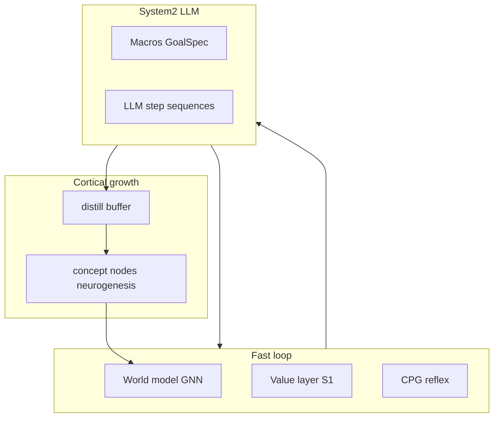
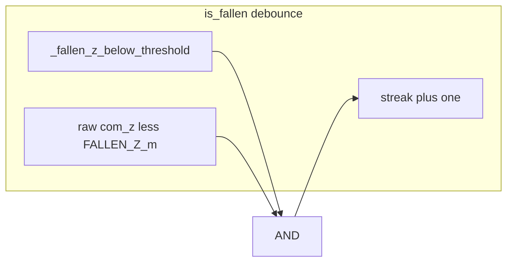

# План: AGI-гуманоид — System2 (LLM) и нейрогенез «кортекса» (v3)

## Цель и архитектурная рамка

**Замысел:** встроенный гуманоид — это AGI в embodied-форме: нижние петли (рефлексы, CPG, GNN / world model) остаются быстрыми; **System2 с LLM** — медленный **исполнительный и планирующий слой**, который при несостоятельности быстрого контура выдаёт **структурированные моторные программы** (макросы, затем многошаговые JSON-планы) с опорой на **grounded** состояние тела.

**«Нейрогенез реального кортекса» в кодовой базе** — не отдельный орган, а **рост каузального графа и смысловых узлов** поверх уже существующих механизмов: [`materialize_concept_macro`](backend/engine/causal_graph.py) / `concept_s2_*` в [`System2Controller._maybe_materialize_macro_concept`](backend/engine/system2/controller.py), дистилляция в [`LearnedMacroStudent`](backend/engine/system2/learned_student.py), обучение GNN на наблюдениях. Успешные эпизоды S2 (любой задачи) должны **уплотняться** в новые/укрепляемые узлы и рёбра — это и есть кумулятивный «кортекс» в смысле RKK.

**Волна 1 (этот план, фазы A–D):** исправить сенсорику падения, дать S2 **прямую моторную власть** при затянувшемся провале, подключить **grounded LLM-последовательности**, ввести **успех-фильтр** для записи в дистилляцию/нейрогенез.

**Волна 2 (после, не блокер A–D):** те же примитивы для **произвольных целей** (curriculum, verbal goals, доставка); явная таблица `macro / skill_id → success_predicate`; связка с [`physical_curriculum`](backend/engine/physical_curriculum.py) и episodic bridge. Отражено в todo `agi-wave2-roadmap`.

## Диагноз по логам (фаза A — без отдельного «аудита»)

По предоставленным тикам после release: **нормализованный `com_z` остаётся ~0.447**, при этом **`torso_pitch` уходит в пол нормализации (0.05)** на несколько тиков подряд, после чего срабатывает debounced `fallen=True` — визуально агент ещё стоит, физическое падение сильно позже.

Интерпретация для реализации: текущая цепочка «низкий мир» для debounce **не должна опираться только на производные/клипнутые сигналы**, если **высота базы в метрах** не подтверждает падение. Согласованный минимальный фикс:

- Наращивать `_fallen_low_z_streak` в [`HumanoidEnvironment.is_fallen`](backend/engine/features/humanoid/environment.py) **только если одновременно**:
  - `_fallen_z_below_threshold()` (как сейчас, по нормализованному порогу), **и**
  - **сырой** `com_z` из `get_state()` **меньше `FALLEN_Z` в метрах** (константа [`FALLEN_Z`](backend/engine/features/humanoid/constants.py), при необходимости вынести дублирование в маленький helper `com_z_raw_below_fallen()` для читаемости).

Одной фразой: `low_for_streak = _fallen_z_below_threshold() and (raw_com_z < FALLEN_Z)`. При `com_z≈0.8` м и `FALLEN_Z=0.3` streak не растёт при «залипшем» pitch на 0.05 — ложные `fallen` от клипа осанки отсекаются.

Дополнительно в docstring к `is_fallen` кратко зафиксировать связь с **клипом нормализации** по `torso_pitch` / производными из [`_derived_motor_observables`](backend/engine/features/humanoid/environment.py), чтобы следующий читатель не искал «скрытый» порог по pitch в `is_fallen` (его там нет — но симптом в логе объясняется косвенно через observe/граф).

**Отдельный блок телеметрии в tick_run_logger для шага 1 не планируется** (по согласованию с заказчиком).

## Фаза B — S2 override: полномочия исполнителя при провале S1

**Цель AGI-уровня:** когда быстрый контур (скоринг VL + GNN) **не вытягивает** ситуацию, S2 действует как **override-исполнитель** — не очередной кандидат с низким приоритетом, а прямой канал в мотор (см. ограничения CPG ниже).

1. Счётчик на симуляции ([`simulation_main.py`](backend/engine/features/simulation/simulation_main.py) / [`mixin_tick`](backend/engine/features/simulation/mixin_tick.py)): `_s2_fallen_override_active`, `_s2_fallen_override_start_tick`, сброс при `not fallen` и при завершении override.
2. Точка входа — после вычисления `fallen`, **до** `agent.step`: `System2Controller.apply_fallen_override(...)` — обход/ослабление `_should_apply_residuals` (env `RKK_S2_OVERRIDE_BYPASS_CPG_GUARD`, по умолчанию вкл.), применение `macro_bundle("RECOVER_POSTURE")` + residuals **без** `set_system2_candidate` / VL.
3. **Обязательный таймаут:** `RKK_S2_OVERRIDE_MAX_TICKS` — если за это время агент всё ещё в состоянии, требующем override (или `fallen` всё ещё true — уточнить в реализации одним правилом), выполнить **explicit reset** (например существующий [`reset_stance`](backend/engine/features/humanoid/environment.py) + согласованный сброс графа/стreak как в текущем fall-recovery), затем выйти из override. Иначе риск «вечной борьбы с CPG» лёжа.
4. Диагностика: `_system2_last` — `override_active`, `override_ticks`, `fallen_streak`, факт срабатывания max-reset.

## Фаза C — LLM как планировщик моторных программ (grounded)

**Цель AGI-уровня:** LLM не «болтает», а выдаёт **проверяемую** последовательность воздействий на `intent_*`, привязанную к **текущему телу** — иначе нет переноса на рост кортекса через дистилляцию.

1. Контракт JSON ([`teacher.py`](backend/engine/system2/teacher.py) / [`schema.py`](backend/engine/system2/schema.py)): `steps[]` с `ticks` и `intent_deltas`, валидация ключей.
2. **Обязательный compact state vector в промпте:** нормализованные и/или сырые признаки, релевантные позе (`com_z`, `torso_pitch`, `torso_roll`, `foot_contact_l/r`, при необходимости `posture_stability`, `support_bias`) — без этого generic «руки → торс → ноги» нестабилен при разных положениях тела.
3. Планировщик в `System2Controller`: `recovery_sequence`, индекс шага, `until_tick`; один async-запрос к LLM при входе в режим (по аналогии с текущим LLM-потоком), затем детерминированное применение шагов.
4. Fallback без LLM: последовательность из env или текущий `RECOVER_POSTURE` bundle.

## Фаза D — Нейрогенез / дистилляция как рост кортекса (граф)

**Не самоцель «учить только вставать».** Гуманоид — общий агент: цель override / макроса / LLM-плана может быть **любой** (подъём, удержание осанки, сдвиг COM, доставка, исследование и т.д.). **Кортекс в RKK** — это прежде всего **расширяющийся каузальный граф** (`concept_*`, новые рёбра, закрепление паттернов в GNN): нейрогенез материализует **повторяемые успешные стратегии** S2 в узлы, доступные System1 и дальнейшему планированию.

1. **Фильтр качества, а не сужение домена:** в буфер дистилляции / на материализацию `concept_*` попадают только **успешные** эпизоды — чтобы не учить мир на шуме и зацикленных провалах. Критерий успеха **зависит от задачи** (пример для падения: `com_z` / осанка выше порога после override; для другого макроса — заранее заданные `GoalSpec` / дельты наблюдаемых из compact state). Для первой итерации override-пути достаточно конфигурируемого «success predicate» (env или таблица по `macro_id`); **волна 2** — полная таблица `macro/skill_id → predicate` и связка с curriculum (todo `agi-wave2-roadmap`).
2. Переиспользовать [`LearnedMacroStudent`](backend/engine/system2/learned_student.py) и [`_maybe_materialize_macro_concept`](backend/engine/system2/controller.py): streak / `detector_id` от **имени макроса или типа эпизода** (`system2:RECOVER_POSTURE`, позже — произвольные skill ids из LLM-плана).
3. Опционально: episodic / world bridge после N успехов **по тому же типу эпизода** — без привязки только к «встал с пола».

## Порядок и тесты

| Фаза | Содержание |
|------|------------|
| A | Конъюнкция `is_fallen` + тесты на streak |
| B | Override + max ticks + explicit reset |
| C | LLM steps + compact state |
| D | Кортекс: успех-фильтр → дистилляция / `concept_*` (любая задача S2) |

- Тесты: unit на `is_fallen` (streak не растёт при высоком raw `com_z` и «плохом» pitch в observe); при возможности — мок override и max-reset; схема LLM — валидация невалидных ключей отклоняется.
- Регрессия: [`test_system2_schema.py`](backend/tests/test_system2_schema.py), perf-guards.

## Риски (обновлено)

- **CPG vs S2:** guard + `RKK_S2_OVERRIDE_MAX_TICKS` + explicit reset обязательны.
- **Конъюнкция raw z:** при экстремальном случае «низкий z в один тик без подтверждения нормализованным порогом» оставить `_fallen_z_below_threshold()` второй частью AND — крайние пороги вынести в env при необходимости.
- **LLM и тело:** галлюцинации моторных имён / экстремальные дельты — жёсткая валидация по `MOTOR_INTENT_VARS`, clamp, лимит шагов и тиков на шаг; при провале — fallback-макрос без LLM.
- **AGI-скоп:** волна 1 не заменяет полный curriculum-goal loop; волна 2 (todo `agi-wave2-roadmap`) выносит обобщение целей и предикатов успеха.
