# Critical Analysis: RKK → Autonomous AGI/ASI Humanoid

## Главный диагноз: Одна корневая проблема

> [!CAUTION]
> **Статическая онтология переменных** — это не один из недостатков, это **единственный фундаментальный дефект**, из которого каскадно следуют все остальные. Система не умеет _сама решать из чего состоит мир_.

У биологического интеллекта нет заранее заданных `VAR_NAMES`. Мозг младенца не рождается со списком из 60+ переменных. Он начинает с сырых сенсорных потоков и **строит** свою онтологию. RKK делает наоборот: человек решил что важно, записал в [constants.py](file:///c:/Users/Andrey/Desktop/agi/rkk/backend/engine/features/humanoid/constants.py), и всё — агент навсегда заперт в этом пространстве.

---

## Tier 1 — Корневая архитектурная проблема

### 1. Захардкоженная онтология пронизывает ВСЁ

```
constants.py::VAR_NAMES (68 var) 
    ↓
environment.py::observe()     — фиксированный dict
    ↓
causal_graph.py::_node_ids    — фиксированная GNN матрица d×d
    ↓
agent.py::score_interventions — перебор по ЭТИМ переменным
    ↓
sleep_consolidation.py        — replay по ЭТИМ переменным
    ↓
snapshot.py → UI              — показывает ТОЛЬКО ЭТИ переменные
```

**Почему это блокирует AGI:**

| Свойство AGI | Статус в RKK | Причина |
|---|---|---|
| Открытый мир (open-ended) | ❌ | Агент не может «увидеть» то, что не в VAR_NAMES |
| Перенос знаний (transfer) | ❌ | Граф привязан к конкретному телу, не к абстракциям |
| Масштабирование | ❌ | d=68 → O(d²) пар = 4,556 кандидатов каждый тик |
| Самоорганизация | ⚠️ | VariableDiscovery есть, но node_ids заложены заранее |

**Конкретные файлы захардкоженности:**

- [constants.py:9-67](file:///c:/Users/Andrey/Desktop/agi/rkk/backend/engine/features/humanoid/constants.py#L9-L67) — 9 категорий вручную (TORSO, SPINE, HEAD, LEG, ARM, FOOT, CUBE, SANDBOX, SELF)
- [constants.py:102-134](file:///c:/Users/Andrey/Desktop/agi/rkk/backend/engine/features/humanoid/constants.py#L102-L134) — `_RANGES` для нормализации — человек решил диапазоны
- [environment.py:474-542](file:///c:/Users/Andrey/Desktop/agi/rkk/backend/engine/features/humanoid/environment.py#L474-L542) — `gt_edges()` — **40+ ground-truth рёбер заданных вручную**
- [environment.py:126-181](file:///c:/Users/Andrey/Desktop/agi/rkk/backend/engine/features/humanoid/environment.py#L126-L181) — `_derived_motor_observables()` — **формулы posture_stability, gait_phase вручную**
- [environment.py:351-377](file:///c:/Users/Andrey/Desktop/agi/rkk/backend/engine/features/humanoid/environment.py#L351-L377) — `_apply_motor_intents()` — **ноги/руки по формулам**

> [!IMPORTANT]
> `posture_stability`, `gait_phase_l/r`, `support_bias` — это **результаты вычислений по формулам, написанным человеком**. Настоящий AGI должен _открыть_ эти концепты из потока сенсорных данных.

---

## Tier 2 — Следствия корневой проблемы

### 2. GNN не масштабируется за пределы предписанной онтологии

| Файл | Проблема |
|---|---|
| [causal_gnn.py](file:///c:/Users/Andrey/Desktop/agi/rkk/backend/engine/causal_gnn.py) | W: d×d = 68×68 = 4,624 параметра. Message passing O(d²·hidden). При d=200+ — CPU-bottleneck |
| [causal_graph.py:460-570](file:///c:/Users/Andrey/Desktop/agi/rkk/backend/engine/causal_graph.py#L460-L570) | `train_step()` — DAG constraint `tr(exp(W²))` через Taylor 4-го порядка: 4 matmul d×d. При d=200 → ~64M FLOP/tick |
| [agent.py:486-680](file:///c:/Users/Andrey/Desktop/agi/rkk/backend/engine/agent.py#L486-L680) | `score_interventions()` — d²=4556 пар, каждая → feature vector, EIG batch через GNN forward |

**Проблема производительности:** не GPU vs CPU, а **экспоненциальный рост с числом переменных**. Текущая архитектура O(d²) на тик. При d=200 (что нужно для открытого мира) это 40,000 пар — система встанет.

### 3. Sleep по таймеру вместо data-driven trigger

[sleep_consolidation.py:367-387](file:///c:/Users/Andrey/Desktop/agi/rkk/backend/engine/sleep_consolidation.py#L367-L387):

```python
def check_trigger(self, tick, total_falls, force=False):
    if (tick - self.last_sleep_tick) >= self._every_ticks:  # HARDCODE: 10000 тиков
        return "periodic"
    if self._falls_since_sleep >= self._fall_threshold:     # HARDCODE: 50 падений
        return "fall_threshold"
```

Но уже есть `CausalSurprise.compression_is_stagnant()` в [intristic_objective.py:165-170](file:///c:/Users/Andrey/Desktop/agi/rkk/backend/engine/intristic_objective.py#L165-L170) — он просто **не подключён** к sleep controller. Сон должен наступать когда мозг перестаёт учиться, а не когда прошло N тиков.

### 4. Формульная моторика вместо learned primitives

[environment.py:351-377](file:///c:/Users/Andrey/Desktop/agi/rkk/backend/engine/features/humanoid/environment.py#L351-L377) — `_apply_motor_intents()`:

```python
self._sim.set_joint("lhip", clip01(0.50 + 0.14*stride - 0.08*sup_r + 0.05*torso ...))
self._sim.set_joint("rhip", clip01(0.50 - 0.14*stride - 0.08*sup_l + 0.05*torso ...))
```

Коэффициенты 0.14, 0.08, 0.05, 0.06 — **подобраны человеком**. Это прямая противоположность автономному обучению моторики. `learned_motor_primitives.py` существует (21KB модуль), но моторика всё ещё на формулах.

### 5. Ground-truth рёбра — внешний учитель навсегда

[environment.py:474-542](file:///c:/Users/Andrey/Desktop/agi/rkk/backend/engine/features/humanoid/environment.py#L474-L542) — `gt_edges()` возвращает 40+ рёбер с весами (`intent_stride→lhip=0.7`). Они используются в `discovery_rate()`, но сам факт их существования означает: **система оценивает себя по метрике, заданной человеком**. AGI не должен знать правильный ответ заранее.

---

## Tier 3 — Производительность и GPU

### Текущая ситуация

| Компонент | FLOP/tick (d=68) | GPU нужен? |
|---|---|---|
| GNN forward_dynamics | ~200K | Нет |
| DAG constraint (Taylor-4) | ~50K | Нет |
| score_interventions (batch EIG) | ~2M | Нет на d=68 |
| REM replay (20 episodes) | ~4M | Нет |
| **ИТОГО** | ~6-7M | **CPU достаточно** |

> [!TIP]
> **GPU не нужен при текущем d=68.** Проблема будет при d>300, но к тому моменту нужна другая архитектура (sparse attention, не dense d×d). Текущий отказ от GPU — **правильное решение** для этого размера. Единственное узкое место — `score_interventions` с O(d²) перебором пар.

### Что реально ускорит систему (без GPU):

1. **Sparse score**: вместо d² пар — только пары с uncertainty > threshold (~80% отсечения)
2. **Chunk + amortize**: `_score_cache_every=4` уже есть, но по умолчанию =1
3. **Adaptive d**: если нет cube/sandbox → убрать эти переменные из графа (d=68→d=40)
4. **DAG constraint skip**: при h(W) < 0.01 — считать раз в 8 тиков

---

## Единая архитектурная рекомендация

```mermaid
graph TB
    subgraph "Текущая архитектура (Hardcoded)"
        H[Human defines 68 VAR_NAMES] --> E[Environment.observe\nmaps to dict]
        E --> G[CausalGraph d=68 fixed]
        G --> A[Agent scores d² pairs]
    end

    subgraph "Целевая архитектура (Open-ended)"
        S[Sensory stream\njoint torques + contact + IMU] --> VQ[VQ-VAE / Tokenizer\nlearns discrete codes]
        VQ --> |"discovered variables"| OG[Open CausalGraph\nd grows/shrinks]
        OG --> SA[Sparse Attention\nonly high-uncertainty pairs]
        SA --> |"compression stagnant"| SL[Sleep triggers]
        VQ --> |"new token = new variable"| OG
    end
    
    style H fill:#ff4444,stroke:#333,color:#fff
    style VQ fill:#44ff44,stroke:#333
    style OG fill:#44aaff,stroke:#333
```



### Конкретные шаги (по приоритету)

| # | Что | Файл | Эффект |
|---|---|---|---|
| 1 | `variable_bootstrap.py` — начать с ~10 var (com_z, contact_l/r, 6 joints) | NEW | Убирает 58 захардкоженных var |
| 2 | VariableDiscovery → подключить к `set_node()` GNN | [intristic_objective.py:452-495](file:///c:/Users/Andrey/Desktop/agi/rkk/backend/engine/intristic_objective.py#L452-L495) | Агент сам добавляет переменные |
| 3 | `SleepController.should_sleep()` → `causal_surprise.compression_is_stagnant()` | [sleep_consolidation.py:367-387](file:///c:/Users/Andrey/Desktop/agi/rkk/backend/engine/sleep_consolidation.py#L367-L387) | Data-driven сон |
| 4 | `_derived_motor_observables()` → заменить на learned embeddings | [environment.py:126-181](file:///c:/Users/Andrey/Desktop/agi/rkk/backend/engine/features/humanoid/environment.py#L126-L181) | Формулы → нейросеть |
| 5 | Sparse EIG: score только пары с unc > 0.3 | [agent.py:486-680](file:///c:/Users/Andrey/Desktop/agi/rkk/backend/engine/agent.py#L486-L680) | x3-5 speedup |
| 6 | Удалить `gt_edges()` / заменить на self-supervised metric | [environment.py:474-542](file:///c:/Users/Andrey/Desktop/agi/rkk/backend/engine/features/humanoid/environment.py#L474-L542) | Нет внешнего учителя |

---

## Резюме

Проект выдающийся по уровню инженерии: CausalGNN + IntrinsicObjective + Sleep + VariableDiscovery + GoalImagination — это настоящий каркас для AGI. Но фундамент **инвертирован**: вместо «мир→агент открывает переменные→строит модель» сейчас «человек→задаёт переменные→агент учит связи». 

**Один корень → три следствия:**

| Корень | Следствие |
|---|---|
| Статические VAR_NAMES | Закрытый мир, нет transfer |
| Формульная моторика | Нет моторного обучения |
| Таймерный сон | Нет адаптивной консолидации |

GPU не нужен. Нужна **открытая онтология**.
